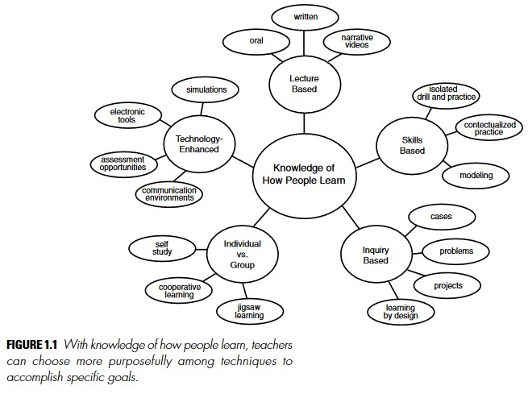
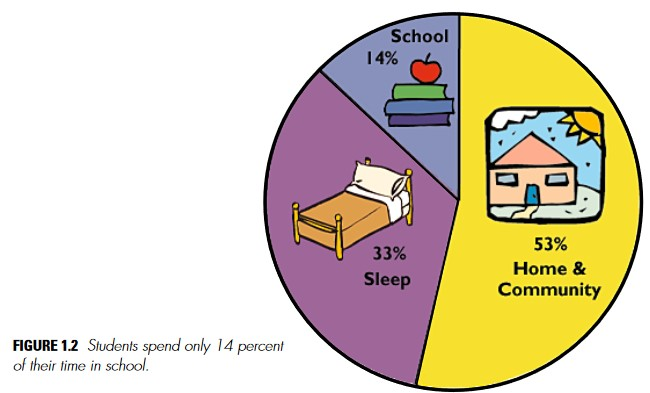

# 1

# Learning: From Speculation to Science

The essence of matter, the origins of the universe, the nature of the human mind these are the profound questions that have engaged thinkers through the centuries. Until quite recently, understanding the mind and the thinking and learning that the mind makes possible has remained an elusive quest, in part because of a lack of powerful research tools. Today, the world is in the midst of an extraordinary outpouring of scientific work on the mind and brain, on the processes of thinking and learning, on the neural processes that occur during thought and learning, and on the devel opment of competence.

The revolution in the study of the mind that has occurred in the last three or four decades has important implications for education. As we illustrate, a new theory of learning is coming into focus that leads to very different approaches to the design of curriculum, teaching, and assessment than those often found in schools today. Equally important, the growth of interdisciplinary inquiries and new kinds of scientific collaborations have begun to make the path from basic research to educational practice somewhat more visible, if not yet easy to travel. Thirty years ago, educators paid little attention to the work of cognitive scientists, and researchers in the nascent field of cognitive science worked far removed from classrooms. Today, cognitive researchers are spending more time working with teachers, testing and refining their theories in real classrooms where they can see how different settings and classroom interactions influence applications of their theories.

What is perhaps currently most striking is the variety of research approaches and techniques that have been developed and ways in which evidence from many different branches of science are beginning to converge. The story we can now tell about learning is far richer than ever before, and it promises to evolve dramatically in the next generation. For example:

- Research from cognitive psychology has increased understanding of the nature of competent performance and the principles of knowledge organization that underlie people’s abilities to solve problems in a wide variety of areas, including mathematics, science, literature, social studies, and history.
- Developmental researchers have shown that young children under stand a great deal about basic principles of biology and physical causality, about number, narrative, and personal intent, and that these capabilities make it possible to create innovative curricula that introduce important concepts for advanced reasoning at early ages.
- Research on learning and transfer has uncovered important principles for structuring learning experiences that enable people to use what they have learned in new settings.
- Work in social psychology, cognitive psychology, and anthropology is making clear that all learning takes place in settings that have particular sets of cultural and social norms and expectations and that these settings influence learning and transfer in powerful ways.
- Neuroscience is beginning to provide evidence for many principles of learning that have emerged from laboratory research, and it is showing how learning changes the physical structure of the brain and, with it, the functional organization of the brain.
- Collaborative studies of the design and evaluation of learning environments, among cognitive and developmental psychologists and educators, are yielding new knowledge about the nature of learning and teaching as it takes place in a variety of settings. In addition, researchers are discovering ways to learn from the “wisdom of practice” that comes from successful teachers who can share their expertise.
- Emerging technologies are leading to the development of many new opportunities to guide and enhance learning that were unimagined even a few years ago.

All of these developments in the study of learning have led to an era of new relevance of science to practice. In short, investment in basic research is paying off in practical applications. These developments in understanding of how humans learn have particular significance in light of changes in what is expected of the nation’s educational systems.

In the early part of the twentieth century, education focused on the acquisition of literacy skills: simple reading, writing, and calculating. It was not the general rule for educational systems to train people to think and read critically, to express themselves clearly and persuasively, to solve complex problems in science and mathematics. Now, at the end of the century, these aspects of high literacy are required of almost everyone in order to successfully negotiate the complexities of contemporary life. The skill demands for work have increased dramatically, as has the need for organizations and workers to change in response to competitive workplace pressures. Thoughtful participation in the democratic process has also become increasingly complicated as the locus of attention has shifted from local to national and global concerns.

Above all, information and knowledge are growing at a far more rapid rate than ever before in the history of humankind. As Nobel laureate Herbert Simon wisely stated, the meaning of “knowing” has shifted from being able to remember and repeat information to being able to find and use it (Simon, 1996). More than ever, the sheer magnitude of human knowledge renders its coverage by education an impossibility; rather, the goal of education is better conceived as helping students develop the intellectual tools and learning strategies needed to acquire the knowledge that allows people to think productively about history, science and technology, social phenomena, mathematics, and the arts. Fundamental understanding about subjects, including how to frame and ask meaningful questions about various subject areas, contributes to individuals’ more basic understanding of principles of learning that can assist them in becoming self-sustaining, lifelong learners.

## FOCUS: PEOPLE, SCHOOLS, AND THE POTENTIAL TO LEARN

The scientific literatures on cognition, learning, development, culture, and brain are voluminous. Three organizing decisions, made fairly early in the work of the committee, provided the framework for our study and are reflected in the contents of this book.

- First, we focus primarily on research on human learning (though the study of animal learning provides important collateral information), including new developments from neuroscience.
- Second, we focus especially on learning research that has implications for the design of formal instructional environments, primarily preschools, kindergarten through high schools (K-12), and colleges.
- Third, and related to the second point, we focus on research that helps explore the possibility of helping all individuals achieve their fullest potential.

New ideas about ways to facilitate learning and about who is most capable of learning can powerfully affect the quality of people’s lives. At different points in history, scholars have worried that formal educational environments have been better at selecting talent than developing it (see, e.g., Bloom, 1964). Many people who had difficulty in school might have prospered if the new ideas about effective instructional practices had been available. Furthermore, given new instructional practices, even those who did well in traditional educational environments might have developed skills, knowledge, and attitudes that would have significantly enhanced their achievements.

Learning research suggests that there are new ways to introduce students to traditional subjects, such as mathematics, science, history and literature, and that these new approaches make it possible for the majority of individuals to develop a deep understanding of important subject matter. This committee is especially interested in theories and data that are relevant to the development of new ways to introduce students to such traditional subjects as mathematics, science, history, and literature. There is hope that new approaches can make it possible for a majority of individuals to develop a moderate to deep understanding of important subjects.

## DEVELOPMENT OF THE SCIENCE OF LEARNING

This report builds on research that began in the latter part of the nineteenth century the time in history at which systematic attempts were made to study the human mind through scientific methods. Before then, such study was the province of philosophy and theology. Some of the most influential early work was done in Leipzig in the laboratory of Wilhelm Wundt, who with his colleagues tried to subject human consciousness to precise analysis mainly by asking subjects to reflect on their thought processes through introspection.

By the turn of the century, a new school of behaviorism was emerging. In reaction to the subjectivity inherent in introspection, behaviorists held that the scientific study of psychology must restrict itself to the study of observable behaviors and the stimulus conditions that control them. An extremely influential article, published by John B. Watson in 1913, provides a glimpse of the behaviorist credo:

> . . . all schools of psychology except that of behaviorism claim that “consciousness” is the subject-matter of psychology. Behaviorism, on the contrary, holds that the subject matter of human psychology is the behavior or activities of the human being. Behaviorism claims that “consciousness” is neither a definable nor a useable concept; that it is merely another word for the “soul” of more ancient times. The old psychology is thus dominated by a kind of subtle religious philosophy (p. 1).

Drawing on the empiricist tradition, behaviorists conceptualized learning as a process of forming connections between stimuli and responses. Motivation to learn was assumed to be driven primarily by drives, such as hunger, and the availability of external forces, such as rewards and punishments (e.g., Thorndike, 1913; Skinner, 1950).

In a classic behaviorist study by Edward L. Thorndike (1913), hungry cats had to learn to pull a string hanging in a “puzzle box” in order for a door to open that let them escape and get food. What was involved in learning to escape in this manner? Thorndike concluded that the cats did not think about how to escape and then do it; instead, they engaged in trial-and-error behavior; see Box 1.1. Sometimes a cat in the puzzle box accidentally pulled the strings while playing and the door opened, allowing the cat to escape. But this event did not appear to produce an insight on the part of the cat because, when placed in the puzzle box again, the cat did not immediately pull the string to escape. Instead, it took a number of trials for the cats to learn through trial and error. Thorndike argued that rewards (e.g., food) increased the strength of connections between stimuli and responses. The explanation of what appeared to be complex problem-solving phenomena as escaping from a complicated puzzle box could thus be explained without recourse to unobservable mental events, such as thinking.

>“When put into the box, the cat would show evident signs of discomfort and impulse to escape from confinement. It tries to squeeze through any opening; it claws and bites at the wire; it thrusts its paws out through any opening and claws at everything it reaches. . . . It does not pay very much attention to the food outside but seems simply to strive instinctively to escape from confinement. . . . The cat that is clawing all over the box in her impulsive struggle will probably claw the string or loop or button so as to open the door. And gradually all the other unsuccessful impulses will be stamped out and the particular impulse leading to the successful act will be stamped in by the resulting pleasure, until, after many trials, the cat will, when put in the box, immediately claw the button or loop in a definite way” (Thorndike, 1913:13).

A limitation of early behaviorism stemmed from its focus on observable stimulus conditions and the behaviors associated with those conditions. This orientation made it difficult to study such phenomena as understanding, reasoning, and thinking—phenomena that are of paramount importance for education. Over time, radical behaviorism (often called “Behaviorism with a Capital B”) gave way to a more moderate form of behaviorism (“behaviorism with a small b”) that preserved the scientific rigor of using behavior as data, but also allowed hypotheses about internal “mental” states when these became necessary to explain various phenomena (e.g., Hull, 1943; Spence, 1942).

In the late 1950s, the complexity of understanding humans and their environments became increasingly apparent, and a new field emerged cognitive science. From its inception, cognitive science approached learning from a multidisciplinary perspective that included anthropology, linguistics, philosophy, developmental psychology, computer science, neuroscience, and several branches of psychology (Norman, 1980,1993; Newell and Simon, 1972). New experimental tools, methodologies, and ways of postulating theories made it possible for scientists to begin serious study of mental functioning: to test their theories rather than simply speculate about thinking and learning (see, e.g., Anderson, 1982, 1987; deGroot, 1965,1969; Newell and Simon, 1972; Ericsson and Charness, 1994), and, in recent years, to develop insights into the importance of the social and cultural contexts of learning (e.g., Cole, 1996; Lave, 1988; Lave and Wenger, 1991; Rogoff, 1990; Rogoff et al., 1993). The introduction of rigorous qualitative research methodologies have provided perspectives on learning that complement and enrich the experimental research traditions (Erickson, 1986; Hammersly and Atkinson, 1983; Heath, 1982; Lincoln and Guba, 1985; Marshall and Rossman, 1955; Miles and Huberman, 1984; Spradley, 1979).

### Learning with Understanding

One of the hallmarks of the new science of learning is its emphasis on learning with understanding. Intuitively, understanding is good, but it has been difficult to study from a scientific perspective. At the same time, students often have limited opportunities to understand or make sense of topics because many curricula have emphasized memory rather than understanding. Textbooks are filled with facts that students are expected to memorize, and most tests assess students’ abilities to remember the facts. When studying about veins and arteries, for example, students may be expected to remember that arteries are thicker than veins, more elastic, and carry blood from the heart; veins carry blood back to the heart. A test item for this information may look like the following:

1. Arteries
- Are more elastic than veins
- Carry blood that is pumped from the heart
- Are less elastic than veins
- Both a and b
- Both b and c

The new science of learning does not deny that facts are important for thinking and problem solving. Research on expertise in areas such as chess, history, science, and mathematics demonstrate that experts’ abilities to think and solve problems depend strongly on a rich body of knowledge about subject matter (e.g., Chase and Simon, 1973; Chi et al., 1981; deGroot, 1965). However, the research also shows clearly that “usable knowledge” is not the same as a mere list of disconnected facts. Experts’ knowledge is connected and organized around important concepts (e.g., Newton’s second law of motion); it is “conditionalized” to specify the contexts in which it is applicable; it supports understanding and transfer (to other contexts) rather than only the ability to remember.

For example, people who are knowledgeable about veins and arteries know more than the facts noted above: they also understand why veins and arteries have particular properties. They know that blood pumped from the heart exits in spurts and that the elasticity of the arteries helps accommodate pressure changes. They know that blood from the heart needs to move upward (to the brain) as well as downward and that the elasticity of an artery permits it to function as a one-way valve that closes at the end of each spurt and prevents the blood from flowing backward. Because they understand relationships between the structure and function of veins and arteries, knowledgeable individuals are more likely to be able to use what they have learned to solve novel problems—to show evidence of transfer. For example, imagine being asked to design an artificial artery—would it have to be elastic? Why or why not? An understanding of reasons for the properties of arteries suggests that elasticity may not be necessary—perhaps the problem can be solved by creating a conduit that is strong enough to handle the pressure of spurts from the heart and also function as a one-way valve. An understanding of veins and arteries does not guarantee an answer to this design question, but it does support thinking about alternatives that are not readily available if one only memorizes facts (Bransford and Stein, 1993).

### Pre-Existing Knowledge

An emphasis on understanding leads to one of the primary characteristics of the new science of learning: its focus on the processes of knowing (e.g., Piaget, 1978; Vygotsky, 1978). Humans are viewed as goal-directed agents who actively seek information. They come to formal education with a range of prior knowledge, skills, beliefs, and concepts that significantly influence what they notice about the environment and how they organize and interpret it. This, in turn, affects their abilities to remember, reason, solve problems, and acquire new knowledge.

Even young infants are active learners who bring a point of view to the learning setting. The world they enter is not a “booming, buzzing confusion” (James, 1890), where every stimulus is equally salient. Instead, an infant’s brain gives precedence to certain kinds of information: language, basic concepts of number, physical properties, and the movement of animate and inanimate objects. In the most general sense, the contemporary view of learning is that people construct new knowledge and understandings based on what they already know and believe (e.g., Cobb, 1994; Piaget, 1952, 1973a,b, 1977, 1978; Vygotsky, 1962, 1978). A classic children’s book illustrates this point; see Box 1.2.

A logical extension of the view that new knowledge must be constructed from existing knowledge is that teachers need to pay attention to the incomplete understandings, the false beliefs, and the naive renditions of concepts that learners bring with them to a given subject. Teachers then need to build on these ideas in ways that help each student achieve a more mature understanding. If students’ initial ideas and beliefs are ignored, the understandings that they develop can be very different from what the teacher intends.

Consider the challenge of working with children who believe that the earth is flat and attempting to help them understand that it is spherical. When told it is round, children picture the earth as a pancake rather than as a sphere (Vosniadou and Brewer, 1989). If they are then told that it is round like a sphere, they interpret the new information about a spherical earth within their flat-earth view by picturing a pancake-like flat surface inside or on top of a sphere, with humans standing on top of the pancake. The children’s construction of their new understandings has been guided by a model of the earth that helped them explain how they could stand or walk upon its surface, and a spherical earth did not fit their mental model. Like Fish Is Fish, everything the children heard was incorporated into that preexisting view.

Fish Is Fish is relevant not only for young children, but for learners of all ages. For example, college students often have developed beliefs about physical and biological phenomena that fit their experiences but do not fit scientific accounts of these phenomena. These preconceptions must be addressed in order for them to change their beliefs (e.g., Confrey, 1990; Mestre, 1994; Minstrell, 1989; Redish, 1996).

> Fish Is Fish (Lionni, 1970) describes a fish who is keenly interested in learning about what happens on land, but the fish cannot explore land because it can only breathe in water. It befriends a tadpole who grows into a frog and eventually goes out onto the land. The frog returns to the pond a few weeks later and reports on what he has seen. The frog describes all kinds of things like birds, cows, and people. The book shows pictures of the fish’s representations of each of these descriptions: each is a fish-like form that is slightly adapted to accommodate the frog’s descriptions people are imagined to be fish who walk on their tailfins, birds are fish with wings, cows are fish with udders. This tale illustrates both the creative opportunities and dangers inherent in the fact that people construct new knowledge based on their current knowledge.

A common misconception regarding “constructivist” theories of knowing (that existing knowledge is used to build new knowledge) is that teachers should never tell students anything directly but, instead, should always allow them to construct knowledge for themselves. This perspective confuses a theory of pedagogy (teaching) with a theory of knowing. Constructivists assume that all knowledge is constructed from previous knowledge, irrespective of how one is taught (e.g., Cobb, 1994)—even listening to a lecture involves active attempts to construct new knowledge. Fish Is Fish (Lionni, 1970) and attempts to teach children that the earth is round (Vosniadou and Brewer, 1989) show why simply providing lectures frequently does not work. Nevertheless, there are times, usually after people have first grappled with issues on their own, that “teaching by telling” can work extremely well (e.g., Schwartz and Bransford, 1998). However, teachers still need to pay attention to students’ interpretations and provide guidance when necessary.

There is a good deal of evidence that learning is enhanced when teachers pay attention to the knowledge and beliefs that learners bring to a learning task, use this knowledge as a starting point for new instruction, and monitor students’ changing conceptions as instruction proceeds. For example, sixth graders in a suburban school who were given inquiry-based physics instruction were shown to do better on conceptual physics problems than eleventh and twelfth grade physics students taught by conventional methods in the same school system. A second study comparing seventh-ninth grade urban students with the eleventh and twelfth grade suburban physics students again showed that the younger students, taught by the inquiry-based approach, had a better grasp of the fundamental principles of physics (White and Frederickson, 1997, 1998). New curricula for young children have also demonstrated results that are extremely promising: for example, a new approach to teaching geometry helped second-grade children learn to represent and visualize three-dimensional forms in ways that exceeded the skills of a comparison group of undergraduate students at a leading university (Lehrer and Chazan, 1998). Similarly, young children have been taught to demonstrate powerful forms of early geometry generalizations (Lehrer and Chazan, 1998) and generalizations about science (Schauble et al., 1995; Warren and Rosebery, 1996).

### Active Learning

New developments in the science of learning also emphasize the importance of helping people take control of their own learning. Since understanding is viewed as important, people must learn to recognize when they understand and when they need more information. What strategies might they use to assess whether they understand someone else’s meaning? What kinds of evidence do they need in order to believe particular claims? How can they build their own theories of phenomena and test them effectively?

Many important activities that support active learning have been studied under the heading of “metacognition,” a topic discussed in more detail in Chapters 2 and 3. Metacognition refers to people’s abilities to predict their performances on various tasks (e.g., how well they will be able to remember various stimuli) and to monitor their current levels of mastery and understanding (e.g., Brown, 1975; Flavell, 1973). Teaching practices congruent with a metacognitive approach to learning include those that focus on sense-making, self-assessment, and reflection on what worked and what needs improving. These practices have been shown to increase the degree to which students transfer their learning to new settings and events (e.g., Palincsar and Brown, 1984; Scardamalia et al., 1984; Schoenfeld, 1983, 1985, 1991).

Imagine three teachers whose practices affect whether students learn to take control of their own learning (Scardamalia and Bereiter, 1991). Teacher A’s goal is to get the students to produce work; this is accomplished by supervising and overseeing the quantity and quality of the work done by the students. The focus is on activities, which could be anything from old-style workbook activities to the trendiest of space-age projects. Teacher B assumes responsibility for what the students are learning as they carry out their activities. Teacher C does this as well, but with the added objective of continually turning more of the learning process over to the students. Walking into a classroom, you cannot immediately tell these three kinds of teachers apart. One of the things you might see is the students working in groups to produce videos or multimedia presentations. The teacher is likely to be found going from group to group, checking how things are going and responding to requests. Over the course of a few days, however, differences between Teacher A and Teacher B would become evident. Teacher A’s focus is entirely on the production process and its products—whether the students are engaged, whether everyone is getting fair treatment, and whether they are turning out good pieces of work. Teacher B attends to all of this as well, but Teacher B is also attending to what the students are learning from the experience and is taking steps to ensure that the students are processing content and not just dealing with show. To see a difference between Teachers B and C, however, you might need to go back into the history of the media production project. What brought it about in the first place? Was it conceived from the start as a learning activity, or did it emerge from the students’ own knowledge building efforts? In one striking example of a Teacher C classroom, the students had been studying cockroaches and had learned so much from their reading and observation that they wanted to share it with the rest of the school; the production of a video came about to achieve that purpose (Lamon et al., 1997).

The differences in what might seem to be the same learning activity are thus quite profound. In Teacher A’s classroom, the students are learning something of media production, but the media production may very well be getting in the way of learning anything else. In Teacher B’s classroom, the teacher is working to ensure that the original educational purposes of the activity are met, that it does not deteriorate into a mere media production exercise. In Teacher C’s classroom, the media production is continuous with and a direct outgrowth of the learning that is embodied in the media production. The greater part of Teacher C’s work has been done before the idea of a media production even comes up, and it remains only to help the students keep sight of their purposes as they carry out the project.

These hypothetical teachers—A, B, and C—are abstract models that of course fit real teachers only partly, and more on some days than others. Nevertheless, they provide important glimpses of connections between goals for learning and teaching practices that can affect students’ abilities to accomplish these goals.

### Implications for Education

Overall, the new science of learning is beginning to provide knowledge to improve significantly people’s abilities to become active learners who seek to understand complex subject matter and are better prepared to transfer what they have learned to new problems and settings. Making this happen is a major challenge (e.g., Elmore et al., 1996), but it is not impossible. The emerging science of learning underscores the importance of rethinking what is taught, how it is taught, and how learning is assessed. These ideas are developed throughout this volume.

### An Evolving Science

This volume synthesizes the scientific basis of learning. The scientific achievements include a fuller understanding of: (1) memory and the structure of knowledge; (2) problem solving and reasoning; (3) the early foundations of learning; (4) regulatory processes that govern learning, including metacognition; and (5) how symbolic thinking emerges from the culture and community of the learner.

These key characteristics of learned proficiency by no means plumb the depths of human cognition and learning. What has been learned about the principles that guide some aspects of learning do not constitute a complete picture of the principles that govern all domains of learning. The scientific bases, while not superficial in themselves, do represent only a surface level of a complete understanding of the subject. Only a few domains of learning have been examined in depth, as reflected in this book, and new, emergent areas, such as interactive technologies (Greenfield and Cocking, 1996) are challenging generalizations from older research studies.

As scientists continue to study learning, new research procedures and methodologies are emerging that are likely to alter current theoretical conceptions of learning, such as computational modeling research. The scientific work encompasses a broad range of cognitive and neuroscience issues in learning, memory, language, and cognitive development. Studies of parallel distributed processing, for example (McClelland et al., 1995; Plaut et al., 1996; Munakata et al., 1997; McClelland and Chappell, 1998) look at learning as occurring through the adaptation of connections among participating neurons. The research is designed to develop explicit computational models to refine and extend basic principles, as well as to apply the models to substantive research questions through behavioral experiments, computer simulations, functional brain imaging, and mathematical analyses. These studies are thus contributing to modification of both theory and practice. New models also encompass learning in adulthood to add an important dimension to the scientific knowledge base.

### Key Findings

This volume provides a broad overview of research on learners and learning and on teachers and teaching. Three findings are highlighted here because they have both a solid research base to support them and strong implications for how we teach.

**1. Students come to the classroom with preconceptions about how the world works. If their initial understanding is not engaged, they may fail to grasp the new concepts and information that are taught, or they may learn them for purposes of a test but revert to their preconceptions outside the classroom.**

Research on early learning suggests that the process of making sense of the world begins at a very young age. Children begin in preschool years to develop sophisticated understandings (whether accurate or not) of the phenomena around them (Wellman, 1990). Those initial understandings can have a powerful effect on the integration of new concepts and information. Sometimes those understandings are accurate, providing a foundation for building new knowledge. But sometimes they are inaccurate (Carey and Gelman, 1991). In science, students often have misconceptions of physical properties that cannot be easily observed. In humanities, their preconceptions often include stereotypes or simplifications, as when history is understood as a struggle between good guys and bad guys (Gardner, 1991). A critical feature of effective teaching is that it elicits from students their pre-existing understanding of the subject matter to be taught and provides opportunities to build on or challenge the initial understanding. James Minstrell, a high school physics teacher, describes the process as follows (Minstrell, 1989: 130-131):

>Students’ initial ideas about mechanics are like strands of yarn, some unconnected, some loosely interwoven. The act of instruction can be viewed as helping the students unravel individual strands of belief, label them, and then weave them into a fabric of more complete understanding. Rather than denying the relevancy of a belief, teachers might do better by helping students differentiate their present ideas from and integrate them into conceptual beliefs more like those of scientists.

The understandings that children bring to the classroom can already be quite powerful in the early grades. For example, some children have been found to hold onto their preconception of a flat earth by imagining a round earth to be shaped like a pancake (Vosniadou and Brewer, 1989). This construction of a new understanding is guided by a model of the earth that helps the child explain how people can stand or walk on its surface. Many young children have trouble giving up the notion that one-eighth is greater than one-fourth, because 8 is more than 4 (Gelman and Gallistel, 1978). If children were blank slates, telling them that the earth is round or that one-fourth is greater than one-eighth would be adequate. But since they already have ideas about the earth and about numbers, those ideas must be directly addressed in order to transform or expand them.

Drawing out and working with existing understandings is important for learners of all ages. Numerous research experiments demonstrate the persistence of preexisting understandings among older students even after a new model has been taught that contradicts the naïve understanding. For example, in a study of physics students from elite, technologically oriented colleges, Andrea DiSessa (1982) instructed them to play a computerized game that required them to direct a computer-simulated object called a dynaturtle so that it would hit a target and do so with minimum speed at impact. Participants were introduced to the game and given a hands-on trial that allowed them to apply a few taps with a small wooden mallet to a tennis ball on a table before beginning the game. The same game was also played by elementary schoolchildren. DiSessa found that both groups of students failed dismally. Success would have required demonstrating an understanding of Newton’s laws of motion. Despite their training, college physics students, like the elementary schoolchildren, aimed the moving dynaturtle directly at the target, failing to take momentum into account. Further investigation of one college student who participated in the study revealed that she knew the relevant physical properties and formulas, yet, in the context of the game, she fell back on her untrained conception of how the physical world works.

Students at a variety of ages persist in their beliefs that seasons are caused by the earth’s distance from the sun rather than by the tilt of the earth (Harvard-Smithsonian Center for Astrophysics, 1987), or that an object that had been tossed in the air has both the force of gravity and the force of the hand that tossed it acting on it, despite training to the contrary (Clement, 1982). For the scientific understanding to replace the naïve understanding, students must reveal the latter and have the opportunity to see where it falls short.

**2. To develop competence in an area of inquiry, students must (a) have a deep foundation of factual knowledge, (b) understand facts and ideas in the context of a conceptual framework, and (c) organize knowledge in ways that facilitate retrieval and application.**

This principle emerges from research that compares the performance of experts and novices and from research on learning and transfer. Experts, regardless of the field, always draw on a richly structured information base; they are not just “good thinkers” or “smart people.” The ability to plan a task, to notice patterns, to generate reasonable arguments and explanations, and to draw analogies to other problems are all more closely intertwined with factual knowledge than was once believed.

But knowledge of a large set of disconnected facts is not sufficient. To develop competence in an area of inquiry, students must have opportunities to learn with understanding. Deep understanding of subject matter transforms factual information into usable knowledge. A pronounced difference between experts and novices is that experts’ command of concepts shapes their understanding of new information: it allows them to see patterns, relationships, or discrepancies that are not apparent to novices. They do not necessarily have better overall memories than other people. But their conceptual understanding allows them to extract a level of meaning from information that is not apparent to novices, and this helps them select and remember relevant information. Experts are also able to fluently access relevant knowledge because their understanding of subject matter allows them to quickly identify what is relevant. Hence, their attention is not overtaxed by complex events.

In most areas of study in K-12 education, students will begin as novices; they will have informal ideas about the subject of study, and will vary in the amount of information they have acquired. The enterprise of education can be viewed as moving students in the direction of more formal understanding (or greater expertise). This will require both a deepening of the information base and the development of a conceptual framework for that subject matter.

Geography can be used to illustrate the manner in which expertise is organized around principles that support understanding. A student can learn to fill in a map by memorizing states, cities, countries, etc., and can complete the task with a high level of accuracy. But if the boundaries are removed, the problem becomes much more difficult. There are no concepts supporting the student’s information. An expert who understands that borders often developed because natural phenomena (like mountains or water bodies) separated people, and that large cities often arose in locations that allowed for trade (along rivers, large lakes, and at coastal ports) will easily outperform the novice. The more developed the conceptual understanding of the needs of cities and the resource base that drew people to them, the more meaningful the map becomes. Students can become more expert if the geographical information they are taught is placed in the appropriate conceptual framework.

A key finding in the learning and transfer literature is that organizing information into a conceptual framework allows for greater “transfer”; that is, it allows the student to apply what was learned in new situations and to learn related information more quickly (see Box 1.3). The student who has learned geographical information for the Americas in a conceptual framework approaches the task of learning the geography of another part of the globe with questions, ideas, and expectations that help guide acquisition of the new information. Understanding the geographical importance of the Mississippi River sets the stage for the student’s understanding of the geographical importance of the Nile. And as concepts are reinforced, the student will transfer learning beyond the classroom, observing and inquiring, for example, about the geographic features of a visited city that help explain its location and size (Holyoak, 1984; Novick and Holyoak, 1991).

**3. A “metacognitive” approach to instruction can help students learn to take control of their own learning by defining learning goals and monitoring their progress in achieving them.**

In research with experts who were asked to verbalize their thinking as they worked, it was revealed that they monitored their own understanding carefully, making note of when additional information was required for understanding, whether new information was consistent with what they already knew, and what analogies could be drawn that would advance their understanding. These meta-cognitive monitoring activities are an important component of what is called adaptive expertise (Hatano and Inagaki, 1986).

Because metacognition often takes the form of an internal conversation, it can easily be assumed that individuals will develop the internal dialogue on their own. Yet many of the strategies we use for thinking reflect cultural norms and methods of inquiry (Hutchins, 1995; Brice-Heath, 1981, 1983; Suina and Smolkin, 1994). Research has demonstrated that children can be taught these strategies, including the ability to predict outcomes, explain to oneself in order to improve understanding, note failures to comprehend, activate background knowledge, plan ahead, and apportion time and memory. Reciprocal teaching, for example, is a technique designed to improve students’ reading comprehension by helping them explicate, elaborate, and monitor their understanding as they read (Palincsar and Brown, 1984). The model for using the meta-cognitive strategies is provided initially by the teacher, and students practice and discuss the strategies as they learn to use them. Ultimately, students are able to prompt themselves and monitor their own comprehension without teacher support.

>In one of the most famous early studies comparing the effects of learning a procedure with learning with understanding, two groups of children practiced throwing darts at a target under water (described in Judd, 1908; see a conceptual replication by Hendrickson and Schroeder, 1941). One group received an explanation of the refraction of light, which causes the apparent location of the target to be deceptive. The other group only practiced dart throwing, without the explanation. Both groups did equally well on the practice task, which involved a target 12 inches under water. But the group that had been instructed about the abstract principle did much better when they had to transfer to a situation in which the target was under only 4 inches of water. Because they understood what they were doing, the group that had received instruction about the refraction of light could adjust their behavior to the new task.

The teaching of metacognitive activities must be incorporated into the subject matter that students are learning (White and Frederickson, 1998). These strategies are not generic across subjects, and attempts to teach them as generic can lead to failure to transfer. Teaching metacognitive strategies in context has been shown to improve understanding in physics (White and Frederickson, 1998), written composition (Scardamalia et al., 1984), and heuristic methods for mathematical problem solving (Schoenfeld, 1983, 1984, 1991). And metacognitive practices have been shown to increase the degree to which students transfer to new settings and events (Lin and Lehman, in press; Palincsar and Brown, 1984; Scardamalia et al., 1984; Schoenfeld, 1983, 1984, 1991).

Each of these techniques shares a strategy of teaching and modeling the process of generating alternative approaches (to developing an idea in writing or a strategy for problem solving in mathematics), evaluating their merits in helping to attain a goal, and monitoring progress toward that goal. Class discussions are used to support skill development, with a goal of independence and self-regulation.

### Implications for Teaching

The three core learning principles described above, simple though they seem, have profound implications for the enterprise of teaching and teacher preparation.

**1. Teachers must draw out and work with the preexisting un- derstandings that their students bring with them.** This requires that:

- The model of the child as an empty vessel to be filled with knowledge provided by the teacher must be replaced. Instead, the teacher must actively inquire into students’ thinking, creating classroom tasks and conditions under which student thinking can be revealed. Students’ initial conceptions then provide the foundation on which the more formal understanding of the subject matter is built.
- The roles for assessment must be expanded beyond the traditional concept of testing. The use of frequent formative assessment helps make students’ thinking visible to themselves, their peers, and their teacher. This provides feedback that can guide modification and refinement in thinking. Given the goal of learning with understanding, assessments must tap understanding rather than merely the ability to repeat facts or perform isolated skills.
- Schools of education must provide beginning teachers with opportunities to learn: (a) to recognize predictable preconceptions of students that make the mastery of particular subject matter challenging, (b) to draw out preconceptions that are not predictable, and (c) to work with preconceptions so that children build on them, challenge them and, when appropriate, replace them.

**2. Teachers must teach some subject matter in depth, providing many examples in which the same concept is at work and providing a firm foundation of factual knowledge.** This requires that:

- Superficial coverage of all topics in a subject area must be replaced with in-depth coverage of fewer topics that allows key concepts in that discipline to be understood. The goal of coverage need not be abandoned entirely, of course. But there must be a sufficient number of cases of in depth study to allow students to grasp the defining concepts in specific domains within a discipline. Moreover, in-depth study in a domain often requires that ideas be carried beyond a single school year before students can make the transition from informal to formal ideas. This will require active coordination of the curriculum across school years.
- Teachers must come to teaching with the experience of in-depth
study of the subject area themselves. Before a teacher can develop powerful pedagogical tools, he or she must be familiar with the progress of inquiry and the terms of discourse in the discipline, as well as understand the relationship between information and the concepts that help organize that information in the discipline. But equally important, the teacher must have a grasp of the growth and development of students’ thinking about these concepts. The latter will be essential to developing teaching expertise, but not expertise in the discipline. It may therefore require courses, or course supplements, that are designed specifically for teachers.
- Assessment for purposes of accountability (e.g., statewide assessments) must test deep understanding rather than surface knowledge. Assessment tools are often the standard by which teachers are held accountable. A teacher is put in a bind if she or he is asked to teach for deep conceptual understanding, but in doing so produces students who perform more poorly on standardized tests. Unless new assessment tools are aligned with new approaches to teaching, the latter are unlikely to muster support among the schools and their constituent parents. This goal is as important as it is difficult to achieve. The format of standardized tests can encourage measurement of factual knowledge rather than conceptual understanding, but it also facilitates objective scoring. Measuring depth of understanding can pose challenges for objectivity. Much work needs to be done to minimize the trade-off between assessing depth and assessing objectively.

**3. The teaching of metacognitive skills should be integrated into the curriculum in a variety of subject areas.** Because metacognition often takes the form of an internal dialogue, many students may be unaware of its importance unless the processes are explicitly emphasized by teachers. An emphasis on metacognition needs to accompany instruction in each of the disciplines, because the type of monitoring required will vary. In history, for example, the student might be asking himself, “who wrote this document, and how does that affect the interpretation of events,” whereas in physics the student might be monitoring her understanding of the underlying physical principle at work.

- Integration of metacognitive instruction with discipline-based learning can enhance student achievement and develop in students the ability to learn independently. It should be consciously incorporated into curricula across disciplines and age levels.
- Developing strong metacognitive strategies and learning to teach those strategies in a classroom environment should be standard features of the curriculum in schools of education.

Evidence from research indicates that when these three principles are incorporated into teaching, student achievement improves. For example, the Thinker Tools Curriculum for teaching physics in an interactive computer environment focuses on fundamental physical concepts and properties, allowing students to test their preconceptions in model building and experimentation activities. The program includes an “inquiry cycle” that helps students monitor where they are in the inquiry process. The program asks for students’ reflective assessments and allows them to review the assessments of their fellow students. In one study, sixth graders in a suburban school who were taught physics using Thinker Tools performed better at solving conceptual physics problems than did eleventh and twelfth grade physics students in the same school system taught by conventional methods. A second study comparing urban students in grades 7 to 9 with suburban students in grades 11 and 12 again showed that the younger students taught by the inquiry-based approach had a superior grasp of the fundamental principles of physics (White and Frederickson, 1997, 1998).

### Bringing Order to Chaos

A benefit of focusing on how people learn is that it helps bring order to a seeming cacophony of choices. Consider the many possible teaching strategies that are debated in education circles and the media. Figure 1.1 depicts them in diagram format: lecture-based teaching, text-based teaching, inquiry-based teaching, technology-enhanced teaching, teaching organized around individuals versus cooperative groups, and so forth. Are some of these teaching techniques better than others? Is lecturing a poor way to teach, as many seem to claim? Is cooperative learning effective? Do attempts to use computers (technology-enhanced teaching) help achievement or hurt it?

This volume suggests that these are the wrong questions. Asking which teaching technique is best is analogous to asking which tool is best a hammer, a screwdriver, a knife, or pliers. In teaching as in carpentry, the selection of tools depends on the task at hand and the materials one is working with. Books and lectures can be wonderfully efficient modes of transmitting new information for learning, exciting the imagination, and honing students’ critical faculties but one would choose other kinds of activities to elicit from students their preconceptions and level of understanding, or to help them see the power of using meta-cognitive strategies to monitor their learning. Hands-on experiments can be a powerful way to ground emergent knowledge, but they do not alone evoke the underlying conceptual understandings that aid generalization. There is no universal best teaching practice.

If, instead, the point of departure is a core set of learning principles, then the selection of teaching strategies (mediated, of course, by subject matter, grade level, and desired outcome) can be purposeful. The many possibilities then become a rich set of opportunities from which a teacher constructs an instructional program rather than a chaos of competing alternatives.

Focusing on how people learn also will help teachers move beyond
either-or dichotomies that have plagued the field of education. One such issue is whether schools should emphasize “the basics” or teach thinking and problem-solving skills. This volume shows that both are necessary. Students’ abilities to acquire organized sets of facts and skills are actually enhanced when they are connected to meaningful problem-solving activities, and when students are helped to understand why, when, and how those facts and skills are relevant. And attempts to teach thinking skills without a strong base of factual knowledge do not promote problem-solving ability or support transfer to new situations.

### Designing Classroom Environments

Chapter 6 of this volume proposes a framework to help guide the design and evaluation of environments that can optimize learning. Drawing heavily on the three principles discussed above, it posits four interrelated attributes of learning environments that need cultivation.

**1. Schools and classrooms must be learner centered.** Teachers must pay close attention to the knowledge, skills, and attitudes that learners bring into the classroom. This incorporates the preconceptions regarding subject matter already discussed, but it also includes a broader understanding of the learner. For example:

- Cultural differences can affect students’ comfort level in working collaboratively versus individually, and they are reflected in the background knowledge students bring to a new learning situation (Moll et al., 1993).
- Students’ theories of what it means to be intelligent can affect their performance. Research shows that students who think that intelligence is a fixed entity are more likely to be performance oriented than learning oriented—they want to look good rather than risk making mistakes while learning. These students are especially likely to bail out when tasks become difficult. In contrast, students who think that intelligence is malleable are more willing to struggle with challenging tasks; they are more comfortable with risk (Dweck, 1989; Dweck and Legget, 1988).

Teachers in learner-centered classrooms also pay close attention to the individual progress of each student and devise tasks that are appropriate. Learner-centered teachers present students with “just manageable difficulties” that is, challenging enough to maintain engagement, but not so difficult as to lead to discouragement. They must therefore have an understanding of their students’ knowledge, skill levels, and interests (Duckworth, 1987).

**2. To provide a knowledge-centered classroom environment, attention must be given to what is taught (information, subject matter), why it is taught (understanding), and what competence or mastery looks like.** As mentioned above, research discussed in the following chapters shows clearly that expertise involves well-organized knowledge that supports understanding, and that learning with understanding is important for the development of expertise because it makes new learning easier (i.e., supports transfer).

Learning with understanding is often harder to accomplish than simply memorizing, and it takes more time. Many curricula fail to support learning with understanding because they present too many disconnected facts in too short a time—the “mile wide, inch deep” problem. Tests often reinforce memorizing rather than understanding. The knowledge-centered environment provides the necessary depth of study, assessing student understanding rather than factual memory. It incorporates the teaching of meta-cognitive strategies that further facilitate future learning.

Knowledge-centered environments also look beyond engagement as the primary index of successful teaching (Prawaf et al., 1992). Students’ interest or engagement in a task is clearly important. Nevertheless, it does not guarantee that students will acquire the kinds of knowledge that will support new learning. There are important differences between tasks and projects that encourage hands-on doing and those that encourage doing with understanding; the knowledge-centered environment emphasizes the latter (Greeno, 1991).

**3. Formative assessments—ongoing assessments designed to make students’ thinking visible to both teachers and students—are essential. They permit the teacher to grasp the students’ preconceptions, understand where the students are in the “developmental corridor” from informal to formal thinking, and design instruction accordingly. In the assessment-centered classroom environment, formative assessments help both teachers and students monitor progress.**

An important feature of assessments in these classrooms is that they be learner-friendly: they are not the Friday quiz for which information is memorized the night before, and for which the student is given a grade that ranks him or her with respect to classmates. Rather, these assessments should provide students with opportunities to revise and improve their thinking (Vye et al., 1998b), help students see their own progress over the course of weeks or months, and help teachers identify problems that need to be remedied (problems that may not be visible without the assessments). For example, a high school class studying the principles of democracy might be given a scenario in which a colony of people have just settled on the moon and must establish a government. Proposals from students of the defining features of such a government, as well as discussion of the problems they foresee in its establishment, can reveal to both teachers and students areas in which student thinking is more and less advanced. The exercise is less a test than an indicator of where inquiry and instruction should focus.

**4. Learning is influenced in fundamental ways by the context in which it takes place. A community-centered approach requires the development of norms for the classroom and school, as well as connections to the outside world, that support core learning values.**

The norms established in the classroom have strong effects on students’ achievement. In some schools, the norms could be expressed as “don’t get caught not knowing something.” Others encourage academic risk-taking and opportunities to make mistakes, obtain feedback, and revise. Clearly, if students are to reveal their preconceptions about a subject matter, their questions, and their progress toward understanding, the norms of the school must support their doing so.

Teachers must attend to designing classroom activities and helping students organize their work in ways that promote the kind of intellectual camaraderie and the attitudes toward learning that build a sense of community. In such a community, students might help one another solve problems by building on each other’s knowledge, asking questions to clarify explanations, and suggesting avenues that would move the group toward its goal (Brown and Campione, 1994). Both cooperation in problem solving (Evans, 1989; Newstead and Evans, 1995) and argumentation (Goldman, 1994; Habermas, 1990; Kuhn, 1991; Moshman, 1995a, 1995b; Salmon and Zeitz, 1995; Youniss and Damon, 1992) among students in such an intellectual community enhance cognitive development.

Teachers must be enabled and encouraged to establish a community of learners among themselves (Lave and Wegner, 1991). These communities can build a sense of comfort with questioning rather than knowing the answer and can develop a model of creating new ideas that build on the contributions of individual members. They can engender a sense of the excitement of learning that is then transferred to the classroom, conferring a sense of ownership of new ideas as they apply to theory and practice.

Not least, schools need to develop ways to link classroom learning to other aspects of students’ lives. Engendering parent support for the core learning principles and parent involvement in the learning process is of utmost importance (Moll, 1990; 1986a, 1986b). Figure 1.2 shows the percentage of time, during a calendar year, that students in a large school district spent in school. If one-third of their time outside school (not counting sleeping) is spent watching television, then students apparently spend more hours per year watching television than attending school. A focus only on the hours that students currently spend in school overlooks the many opportunities for guided learning in other settings.

### Applying the Design Framework to Adult Learning

The design framework summarized above assumes that the learners are children, but the principles apply to adult learning as well. This point is particularly important because incorporating the principles in this volume into educational practice will require a good deal of adult learning. Many approaches to teaching adults consistently violate principles for optimizing learning. Professional development programs for teachers, for example, frequently:

- Are not learner centered. Rather than ask teachers where they need help, they are simply expected to attend prearranged workshops.
- Are not knowledge centered. Teachers may simply be introduced to a new technique (like cooperative learning) without being given the opportunity to understand why, when, where, and how it might be valuable to them. Especially important is the need to integrate the structure of activities with the content of the curriculum that is taught.
- Are not assessment centered. In order for teachers to change their practices, they need opportunities to try things out in their classrooms and then receive feedback. Most professional development opportunities do not provide such feedback. Moreover, they tend to focus on change in teaching practice as the goal, but they neglect to develop in teachers the capacity to judge successful transfer of the technique to the classroom or its effects on student achievement.
- Are not community centered. Many professional development opportunities are conducted in isolation. Opportunities for continued contact and support as teachers incorporate new ideas into their teaching are limited, yet the rapid spread of Internet access provides a ready means of maintaining such contact if appropriately designed tools and services are available.

The principles of learning and their implications for designing learning environments apply equally to child and adult learning. They provide a lens through which current practice can be viewed with respect to K-12 teaching and with respect to preparation of teachers in the research and development agenda. The principles are relevant as well when we consider other groups, such as policy makers and the public, whose learning is also required for educational practice to change.