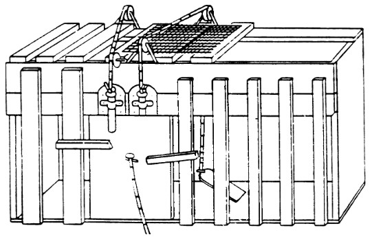

# 1

# Belajar: Dari Spekulasi ke Sains

Esensi materi, asal usul alam semesta, sifat pikiran manusia, inilah pertanyaan-pertanyaan mendalam yang telah melibatkan para pemikir selama berabad-abad. Sampai baru-baru ini, memahami pikiran dan pemikiran dan pembelajaran yang dimungkinkan oleh pikiran tetap merupakan pencarian yang sulit dipahami, sebagian karena kurangnya alat penelitian yang kuat. Saat ini, dunia berada di tengah curahan luar biasa karya ilmiah tentang pikiran dan otak, tentang proses berpikir dan belajar, tentang proses saraf yang terjadi selama berpikir dan belajar, dan pada pengembangan kompetensi.

Revolusi dalam studi tentang pikiran yang terjadi dalam tiga atau empat dekade terakhir memiliki implikasi penting bagi pendidikan. Seperti yang kami ilustrasikan, teori pembelajaran baru menjadi fokus yang mengarah pada pendekatan yang sangat berbeda untuk desain kurikulum, pengajaran, dan penilaian daripada yang sering ditemukan di sekolah saat ini. Sama pentingnya, pertumbuhan penyelidikan interdisipliner dan jenis baru kolaborasi ilmiah telah mulai membuat jalan dari penelitian dasar ke praktik pendidikan agak lebih terlihat, jika belum mudah untuk dilalui. Tiga puluh tahun yang lalu, para pendidik memberikan sedikit perhatian pada karya ilmuwan kognitif, dan para peneliti di bidang ilmu kognitif yang baru lahir bekerja jauh dari ruang kelas. Saat ini, peneliti kognitif menghabiskan lebih banyak waktu bekerja dengan guru, menguji dan menyempurnakan teori mereka di ruang kelas nyata di mana mereka dapat melihat bagaimana pengaturan yang berbeda dan interaksi kelas mempengaruhi penerapan teori mereka.

Apa yang mungkin paling mencolok saat ini adalah berbagai pendekatan dan teknik penelitian yang telah dikembangkan dan cara-cara di mana bukti dari berbagai cabang ilmu pengetahuan mulai bertemu. Kisah yang sekarang dapat kita ceritakan tentang pembelajaran jauh lebih kaya daripada sebelumnya, dan menjanjikan untuk berkembang secara dramatis di generasi berikutnya. Sebagai contoh:

- Penelitian dari psikologi kognitif telah meningkatkan pemahaman tentang sifat kinerja yang kompeten dan prinsip-prinsip organisasi pengetahuan yang mendasari kemampuan orang untuk memecahkan masalah di berbagai bidang, termasuk matematika, sains, sastra, studi sosial, dan sejarah.
- Peneliti perkembangan telah menunjukkan bahwa anak kecil memahami banyak hal tentang prinsip dasar biologi dan kausalitas fisik, tentang jumlah, narasi, dan maksud pribadi, dan bahwa kemampuan ini memungkinkan untuk membuat kurikulum inovatif yang memperkenalkan konsep penting untuk penalaran tingkat lanjut di usia dini.
- Penelitian tentang pembelajaran dan transfer telah mengungkap prinsip-prinsip penting untuk menyusun pengalaman belajar yang memungkinkan orang untuk menggunakan apa yang telah mereka pelajari dalam pengaturan baru.
- Bekerja dalam psikologi sosial, psikologi kognitif, dan antropologi memperjelas bahwa semua pembelajaran terjadi dalam pengaturan yang memiliki seperangkat norma dan harapan budaya dan sosial tertentu dan bahwa pengaturan ini memengaruhi pembelajaran dan transfer dengan cara yang kuat.
- Ilmu saraf mulai memberikan bukti bagi banyak prinsip pembelajaran yang muncul dari penelitian laboratorium, dan ini menunjukkan bagaimana pembelajaran mengubah struktur fisik otak dan, dengan itu, organisasi fungsional otak.
- Studi kolaboratif desain dan evaluasi lingkungan belajar, antara psikolog kognitif dan perkembangan dan pendidik, yang menghasilkan pengetahuan baru tentang sifat belajar dan mengajar seperti yang terjadi dalam berbagai pengaturan. Selain itu, para peneliti menemukan cara untuk belajar dari “kebijaksanaan praktik” yang berasal dari guru-guru sukses yang dapat berbagi keahlian mereka.
- Teknologi yang muncul mengarah pada pengembangan banyak peluang baru untuk memandu dan meningkatkan pembelajaran yang tidak terbayangkan bahkan beberapa tahun yang lalu.

Semua perkembangan ini dalam studi pembelajaran telah menyebabkan era relevansi baru sains untuk praktik. Singkatnya, investasi dalam penelitian dasar terbayar dalam aplikasi praktis. Perkembangan pemahaman tentang bagaimana manusia belajar ini memiliki arti khusus mengingat perubahan dalam apa yang diharapkan dari sistem pendidikan bangsa.

Pada awal abad kedua puluh, pendidikan berfokus pada perolehan keterampilan literasi: membaca, menulis, dan menghitung sederhana. Bukan aturan umum bagi sistem pendidikan untuk melatih orang berpikir dan membaca secara kritis, untuk mengekspresikan diri mereka secara jelas dan persuasif, untuk memecahkan masalah yang kompleks dalam sains dan matematika. Kini, di penghujung abad ini, aspek literasi tinggi ini dibutuhkan hampir semua orang agar berhasil merundingkan kompleksitas kehidupan kontemporer. Tuntutan keterampilan untuk bekerja telah meningkat secara dramatis, seperti halnya kebutuhan organisasi dan pekerja untuk berubah dalam menanggapi tekanan tempat kerja yang kompetitif. Partisipasi yang bijaksana dalam proses demokrasi juga menjadi semakin rumit karena pusat perhatian telah bergeser dari keprihatinan lokal ke nasional dan global.

Di atas segalanya, informasi dan pengetahuan berkembang jauh lebih cepat daripada sebelumnya dalam sejarah umat manusia. Seperti yang dinyatakan dengan bijak oleh peraih Nobel Herbert Simon, arti "mengetahui" telah bergeser dari mampu mengingat dan mengulang informasi menjadi mampu menemukan dan menggunakannya (Simon, 1996). Lebih dari sebelumnya, besarnya pengetahuan manusia membuat cakupannya oleh pendidikan menjadi mustahil; Sebaliknya, tujuan pendidikan lebih baik dipahami sebagai membantu siswa mengembangkan alat intelektual dan strategi pembelajaran yang diperlukan untuk memperoleh pengetahuan yang memungkinkan orang untuk berpikir produktif tentang sejarah, ilmu pengetahuan dan teknologi, fenomena sosial, matematika, dan seni. Pemahaman mendasar tentang mata pelajaran, termasuk bagaimana membingkai dan mengajukan pertanyaan yang bermakna tentang berbagai bidang mata pelajaran, berkontribusi pada pemahaman individu yang lebih mendasar tentang prinsip-prinsip pembelajaran yang dapat membantu mereka menjadi pembelajar yang mandiri dan sepanjang hayat.

## FOKUS: ORANG, SEKOLAH, DAN POTENSI UNTUK BELAJAR

Literatur ilmiah tentang kognisi, pembelajaran, pengembangan, budaya, dan otak sangat banyak. Tiga keputusan pengorganisasian, yang dibuat cukup awal dalam pekerjaan komite, memberikan kerangka kerja untuk penelitian kami dan tercermin dalam isi buku ini.

- Pertama, kami fokus terutama pada penelitian tentang pembelajaran manusia (meskipun studi tentang pembelajaran hewan memberikan informasi tambahan yang penting), termasuk perkembangan baru dari ilmu saraf.
- Kedua, kami fokus terutama pada penelitian pembelajaran yang berimplikasi pada desain lingkungan instruksional formal, terutama prasekolah, taman kanak-kanak hingga sekolah menengah atas (K-12), dan perguruan tinggi.
- Ketiga, dan terkait dengan poin kedua, kami fokus pada penelitian yang membantu mengeksplorasi kemungkinan membantu semua individu mencapai potensi maksimal mereka.

Ide-ide baru tentang cara untuk memfasilitasi pembelajaran dan tentang siapa yang paling mampu belajar dapat sangat mempengaruhi kualitas kehidupan masyarakat. Pada titik yang berbeda dalam sejarah, para sarjana khawatir bahwa lingkungan pendidikan formal lebih baik dalam memilih bakat daripada mengembangkannya (lihat, misalnya, Bloom, 1964). Banyak orang yang mengalami kesulitan di sekolah mungkin menjadi makmur jika ide-ide baru tentang praktik pembelajaran yang efektif telah tersedia. Lebih jauh lagi, dengan adanya praktik pembelajaran baru, bahkan mereka yang berhasil dalam lingkungan pendidikan tradisional mungkin telah mengembangkan keterampilan, pengetahuan, dan sikap yang akan secara signifikan meningkatkan prestasi mereka.

Penelitian pembelajaran menunjukkan bahwa ada cara baru untuk memperkenalkan siswa pada mata pelajaran tradisional, seperti matematika, sains, sejarah dan sastra, dan bahwa pendekatan baru ini memungkinkan sebagian besar individu untuk mengembangkan pemahaman mendalam tentang materi pelajaran yang penting. Komite ini secara khusus tertarik pada teori dan data yang relevan dengan pengembangan cara baru untuk memperkenalkan siswa pada mata pelajaran tradisional seperti matematika, sains, sejarah, dan sastra. Ada harapan bahwa pendekatan baru dapat memungkinkan sebagian besar individu untuk mengembangkan pemahaman yang moderat hingga mendalam tentang mata pelajaran penting.

## PENGEMBANGAN ILMU PEMBELAJARAN

Laporan ini didasarkan pada penelitian yang dimulai pada akhir abad kesembilan belas waktu dalam sejarah di mana upaya sistematis dilakukan untuk mempelajari pikiran manusia melalui metode ilmiah. Sebelum itu, studi semacam itu adalah bidang filsafat dan teologi. Beberapa karya awal yang paling berpengaruh dilakukan di Leipzig di laboratorium Wilhelm Wundt, yang bersama rekan-rekannya mencoba membuat kesadaran manusia menjadi analisis yang tepat terutama dengan meminta subjek untuk merenungkan proses pemikiran mereka melalui introspeksi.

Pada pergantian abad, aliran behaviorisme baru muncul. Sebagai reaksi terhadap subjektivitas yang melekat dalam introspeksi, behavioris berpendapat bahwa studi ilmiah psikologi harus membatasi diri pada studi perilaku yang dapat diamati dan kondisi stimulus yang mengendalikannya. Sebuah artikel yang sangat berpengaruh, diterbitkan oleh John B. Watson pada tahun 1913, memberikan sekilas kredo behavioris:

> . . . semua sekolah psikologi kecuali behaviorisme mengklaim bahwa "kesadaran" adalah subjek dari psikologi. Behaviorisme, sebaliknya, berpendapat bahwa subjek psikologi manusia adalah perilaku atau aktivitas manusia. Behaviorisme mengklaim bahwa "kesadaran" bukanlah konsep yang dapat didefinisikan atau digunakan; bahwa itu hanyalah kata lain untuk "jiwa" dari zaman yang lebih kuno. Psikologi lama dengan demikian didominasi oleh semacam filsafat agama yang halus (hal. 1).

Menggambar pada tradisi empiris, behavioris dikonseptualisasikan belajar sebagai proses membentuk hubungan antara rangsangan dan tanggapan. Motivasi untuk belajar diasumsikan didorong terutama oleh dorongan, seperti rasa lapar, dan ketersediaan kekuatan eksternal, seperti penghargaan dan hukuman (misalnya, Thorndike, 1913; Skinner, 1950).

Dalam studi behavioris klasik oleh Edward L. Thorndike (1913), kucing lapar harus belajar menarik tali yang tergantung di "kotak teka-teki" agar pintu terbuka yang memungkinkan mereka melarikan diri dan mendapatkan makanan. Apa yang tercakup dalam belajar melarikan diri dengan cara ini? Thorndike menyimpulkan bahwa kucing-kucing itu tidak memikirkan bagaimana cara melarikan diri dan kemudian melakukannya; sebaliknya, mereka terlibat dalam perilaku coba-coba; lihat Kotak 1.1. Terkadang seekor kucing di dalam kotak puzzle secara tidak sengaja menarik senar saat bermain dan pintu terbuka, memungkinkan kucing tersebut untuk melarikan diri. Namun kejadian ini tampaknya tidak menghasilkan wawasan dari pihak kucing karena, ketika ditempatkan di kotak puzzle lagi, kucing tidak segera menarik tali untuk melarikan diri. Sebaliknya, butuh sejumlah percobaan bagi kucing untuk belajar melalui coba-coba. Thorndike berpendapat bahwa penghargaan (misalnya, makanan) meningkatkan kekuatan hubungan antara rangsangan dan tanggapan. Penjelasan tentang apa yang tampak sebagai fenomena pemecahan masalah yang kompleks sebagai pelarian dari kotak teka-teki yang rumit dengan demikian dapat dijelaskan tanpa bantuan peristiwa mental yang tidak dapat diamati, seperti berpikir.

>“Ketika dimasukkan ke dalam kotak, kucing akan menunjukkan tanda-tanda ketidaknyamanan dan dorongan untuk melarikan diri dari kurungan. Ia mencoba masuk melalui celah apa pun; ia mencakar dan menggigit kawat; ia menjulurkan cakarnya melalui lubang apa pun dan mencakar semua yang dijangkaunya. . . . Ia tidak terlalu memperhatikan makanan di luar tetapi tampaknya hanya berusaha secara naluriah untuk melepaskan diri dari kurungan. . . . Kucing yang mencakar seluruh kotak dalam perjuangan impulsifnya mungkin akan mencakar tali atau lingkaran atau kancing untuk membuka pintu. Dan secara bertahap semua dorongan lain yang tidak berhasil akan dihilangkan dan dorongan tertentu yang mengarah pada tindakan yang berhasil akan dicap oleh kesenangan yang dihasilkan, sampai, setelah banyak percobaan, kucing akan, ketika dimasukkan ke dalam kotak, segera mencakar tombol atau lingkaran dengan cara yang pasti” (Thorndike, 1913:13).

Keterbatasan behaviorisme awal berasal dari fokusnya pada kondisi stimulus yang dapat diamati dan perilaku yang terkait dengan kondisi tersebut. Orientasi ini menyulitkan untuk mempelajari fenomena seperti pemahaman, penalaran, dan pemikiran—fenomena yang sangat penting bagi pendidikan. Seiring waktu, behaviorisme radikal (sering disebut "Behaviorisme dengan B Kapital") memberi jalan kepada bentuk behaviorisme yang lebih moderat ("behaviorisme dengan b kecil") yang mempertahankan kekakuan ilmiah menggunakan perilaku sebagai data, tetapi juga memungkinkan hipotesis tentang keadaan "mental" internal ketika ini menjadi perlu untuk menjelaskan berbagai fenomena (misalnya, Hull, 1943; Spence, 1942).

Pada akhir 1950-an, kompleksitas pemahaman manusia dan lingkungannya menjadi semakin jelas, dan bidang baru muncul ilmu kognitif. Sejak awal, ilmu kognitif mendekati pembelajaran dari perspektif multidisiplin yang mencakup antropologi, linguistik, filsafat, psikologi perkembangan, ilmu komputer, ilmu saraf, dan beberapa cabang psikologi (Norman, 1980,1993; Newell dan Simon, 1972). Alat eksperimental baru, metodologi, dan cara mendalilkan teori memungkinkan para ilmuwan untuk memulai studi serius tentang fungsi mental: untuk menguji teori mereka daripada hanya berspekulasi tentang pemikiran dan pembelajaran (lihat, misalnya, Anderson, 1982, 1987; deGroot, 1965 ,1969; Newell dan Simon, 1972; Ericsson dan Charness, 1994), dan, dalam beberapa tahun terakhir, untuk mengembangkan wawasan tentang pentingnya konteks sosial dan budaya pembelajaran (misalnya, Cole, 1996; Lave, 1988; Lave dan Wenger , 1991; Rogoff, 1990; Rogoff dkk., 1993). Pengenalan metodologi penelitian kualitatif yang ketat telah memberikan perspektif tentang pembelajaran yang melengkapi dan memperkaya tradisi penelitian eksperimental (Erickson, 1986; Hammersly dan Atkinson, 1983; Heath, 1982; Lincoln dan Guba, 1985; Marshall dan Rossman, 1955; Miles dan Huberman , 1984; Spradley, 1979).

### Belajar dengan Pemahaman

Salah satu ciri dari ilmu baru pembelajaran adalah penekanannya pada pembelajaran dengan pemahaman. Secara intuitif, pemahaman itu baik, tetapi sulit untuk mempelajarinya dari perspektif ilmiah. Pada saat yang sama, siswa sering memiliki kesempatan terbatas untuk memahami atau memahami topik karena banyak kurikulum yang lebih menekankan ingatan daripada pemahaman. Buku teks diisi dengan fakta yang diharapkan siswa untuk dihafal, dan sebagian besar tes menilai kemampuan siswa untuk mengingat fakta. Ketika mempelajari tentang vena dan arteri, misalnya, siswa diharapkan untuk mengingat bahwa arteri lebih tebal dari vena, lebih elastis, dan membawa darah dari jantung; vena membawa darah kembali ke jantung. Item tes untuk informasi ini mungkin terlihat seperti berikut:

1. Arteri
- Lebih elastis dari vena
- Membawa darah yang dipompa dari jantung
- Kurang elastis dibandingkan vena
- Baik a dan b
- Baik b dan c

Ilmu baru belajar tidak menyangkal bahwa fakta penting untuk berpikir dan memecahkan masalah. Penelitian tentang keahlian di bidang-bidang seperti catur, sejarah, sains, dan matematika menunjukkan bahwa kemampuan para ahli untuk berpikir dan memecahkan masalah sangat bergantung pada pengetahuan yang kaya tentang materi pelajaran (misalnya, Chase dan Simon, 1973; Chi et al., 1981; deGroot, 1965). Namun, penelitian juga menunjukkan dengan jelas bahwa “pengetahuan yang dapat digunakan” tidak sama dengan sekadar daftar fakta yang terputus. Pengetahuan para ahli terhubung dan terorganisir di sekitar konsep-konsep penting (misalnya, hukum kedua Newton tentang gerak); itu "dikondisikan" untuk menentukan konteks di mana itu berlaku; itu mendukung pemahaman dan transfer (ke konteks lain) daripada hanya kemampuan untuk mengingat.

Misalnya, orang yang memiliki pengetahuan tentang vena dan arteri tahu lebih banyak daripada fakta yang disebutkan di atas: mereka juga memahami mengapa vena dan arteri memiliki sifat tertentu. Mereka tahu bahwa darah yang dipompa dari jantung keluar dengan cepat dan bahwa elastisitas arteri membantu mengakomodasi perubahan tekanan. Mereka tahu bahwa darah dari jantung perlu bergerak ke atas (ke otak) dan juga ke bawah dan bahwa elastisitas arteri memungkinkannya berfungsi sebagai katup satu arah yang menutup pada akhir setiap semburan dan mencegah darah mengalir. mengalir mundur. Karena mereka memahami hubungan antara struktur dan fungsi vena dan arteri, individu yang berpengetahuan lebih mungkin untuk dapat menggunakan apa yang telah mereka pelajari untuk memecahkan masalah baru—untuk menunjukkan bukti transfer. Misalnya, bayangkan diminta untuk merancang arteri buatan—apakah harus elastis? Mengapa atau mengapa tidak? Pemahaman tentang alasan sifat-sifat arteri menunjukkan bahwa elastisitas mungkin tidak diperlukan—mungkin masalahnya dapat diselesaikan dengan membuat saluran yang cukup kuat untuk menangani tekanan semburan dari jantung dan juga berfungsi sebagai katup satu arah. Pemahaman tentang vena dan arteri tidak menjamin jawaban atas pertanyaan desain ini, tetapi mendukung pemikiran tentang alternatif yang tidak tersedia jika seseorang hanya mengingat fakta (Bransford dan Stein, 1993).

### Pengetahuan yang Sudah Ada Sebelumnya

Penekanan pada pemahaman mengarah ke salah satu karakteristik utama dari ilmu baru belajar: fokusnya pada proses mengetahui (misalnya, Piaget, 1978; Vygotsky, 1978). Manusia dipandang sebagai agen yang diarahkan pada tujuan yang secara aktif mencari informasi. Mereka datang ke pendidikan formal dengan berbagai pengetahuan, keterampilan, keyakinan, dan konsep sebelumnya yang secara signifikan mempengaruhi apa yang mereka perhatikan tentang lingkungan dan bagaimana mereka mengatur dan menafsirkannya. Hal ini, pada gilirannya, mempengaruhi kemampuan mereka untuk mengingat, bernalar, memecahkan masalah, dan memperoleh pengetahuan baru.

Bahkan bayi kecil adalah pembelajar aktif yang membawa sudut pandang ke lingkungan belajar. Dunia yang mereka masuki bukanlah "kebingungan yang menggelegar" (James, 1890), di mana setiap rangsangan sama pentingnya. Sebaliknya, otak bayi mengutamakan jenis informasi tertentu: bahasa, konsep dasar bilangan, sifat fisik, dan pergerakan benda hidup dan mati. Dalam pengertian yang paling umum, pandangan kontemporer tentang pembelajaran adalah bahwa orang membangun pengetahuan dan pemahaman baru berdasarkan apa yang telah mereka ketahui dan yakini (misalnya, Cobb, 1994; Piaget, 1952, 1973a,b, 1977, 1978; Vygotsky, 1962, 1978). Buku anak-anak klasik mengilustrasikan hal ini; lihat Kotak 1.2.

Perpanjangan logis dari pandangan bahwa pengetahuan baru harus dibangun dari pengetahuan yang ada adalah bahwa guru perlu memperhatikan pemahaman yang tidak lengkap, keyakinan yang salah, dan penafsiran konsep yang naif yang dibawa peserta didik ke mata pelajaran tertentu. Guru kemudian perlu membangun ide-ide ini dengan cara yang membantu setiap siswa mencapai pemahaman yang lebih matang. Jika ide dan keyakinan awal siswa diabaikan, pemahaman yang mereka kembangkan bisa sangat berbeda dari apa yang dimaksudkan guru.

Pertimbangkan tantangan bekerja dengan anak-anak yang percaya bahwa bumi itu datar dan berusaha membantu mereka memahami bahwa bumi itu bulat. Ketika diberitahu itu bulat, anak-anak membayangkan bumi sebagai panekuk daripada sebagai bola (Vosniadou dan Brewer, 1989). Jika mereka kemudian diberitahu bahwa itu bulat seperti bola, mereka menafsirkan informasi baru tentang bumi bulat dalam pandangan bumi datar mereka dengan membayangkan permukaan datar seperti panekuk di dalam atau di atas bola, dengan manusia berdiri di atasnya. panekuk. Konstruksi pemahaman baru anak-anak telah dipandu oleh model bumi yang membantu mereka menjelaskan bagaimana mereka dapat berdiri atau berjalan di permukaannya, dan bumi yang bulat tidak sesuai dengan model mental mereka. Seperti Ikan Adalah Ikan, semua yang didengar anak-anak digabungkan ke dalam pandangan yang sudah ada sebelumnya.

Fish Is Fish relevan tidak hanya untuk anak kecil, tetapi untuk pelajar dari segala usia. Misalnya, mahasiswa sering mengembangkan keyakinan tentang fenomena fisik dan biologis yang sesuai dengan pengalaman mereka tetapi tidak sesuai dengan penjelasan ilmiah tentang fenomena ini. Prakonsepsi ini harus diatasi agar mereka dapat mengubah keyakinan mereka (misalnya, Confrey, 1990; Mestre, 1994; Minstrell, 1989; Redish, 1996).

> Fish Is Fish (Lionni, 1970) menggambarkan ikan yang sangat tertarik untuk mempelajari apa yang terjadi di darat, tetapi ikan tersebut tidak dapat menjelajahi daratan karena hanya dapat bernafas di air. Ia berteman dengan kecebong yang tumbuh menjadi katak dan akhirnya pergi ke darat. Katak itu kembali ke kolam beberapa minggu kemudian dan melaporkan apa yang telah dilihatnya. Katak menggambarkan segala macam hal seperti burung, sapi, dan manusia. Buku ini menunjukkan gambar-gambar representasi ikan dari masing-masing deskripsi ini: masing-masing adalah bentuk seperti ikan yang sedikit disesuaikan untuk mengakomodasi deskripsi katak, orang dibayangkan sebagai ikan yang berjalan di ekornya, burung adalah ikan dengan sayap, sapi adalah ikan dengan ambing. Kisah ini menggambarkan peluang dan bahaya kreatif yang melekat pada fakta bahwa orang membangun pengetahuan baru berdasarkan pengetahuan mereka saat ini.

Kesalahpahaman umum mengenai teori pengetahuan "konstruktivis" (bahwa pengetahuan yang ada digunakan untuk membangun pengetahuan baru) adalah bahwa guru tidak boleh memberi tahu siswa apa pun secara langsung tetapi, sebaliknya, harus selalu membiarkan mereka membangun pengetahuan untuk diri mereka sendiri. Perspektif ini mengacaukan teori pedagogi (pengajaran) dengan teori mengetahui. Konstruktivis berasumsi bahwa semua pengetahuan dibangun dari pengetahuan sebelumnya, terlepas dari bagaimana seseorang diajarkan (misalnya, Cobb, 1994)—bahkan mendengarkan ceramah melibatkan upaya aktif untuk membangun pengetahuan baru. Fish Is Fish (Lionni, 1970) dan upaya untuk mengajari anak-anak bahwa bumi itu bulat (Vosniadou dan Brewer, 1989) menunjukkan mengapa sekadar memberikan kuliah sering kali tidak berhasil. Namun demikian, ada kalanya, biasanya setelah orang pertama kali bergulat dengan masalah mereka sendiri, bahwa "mengajar dengan memberi tahu" dapat bekerja dengan sangat baik (misalnya, Schwartz dan Bransford, 1998). Namun, guru tetap perlu memperhatikan interpretasi siswa dan memberikan bimbingan bila diperlukan.

Ada banyak bukti bahwa pembelajaran ditingkatkan ketika guru memperhatikan pengetahuan dan keyakinan yang dibawa peserta didik ke tugas belajar, menggunakan pengetahuan ini sebagai titik awal untuk instruksi baru, dan memantau konsepsi siswa yang berubah saat instruksi berlangsung. Misalnya, siswa kelas enam di sekolah pinggiran kota yang diberi instruksi fisika berbasis inkuiri terbukti lebih baik dalam masalah fisika konseptual daripada siswa fisika kelas sebelas dan dua belas yang diajarkan dengan metode konvensional dalam sistem sekolah yang sama. Studi kedua yang membandingkan siswa kelas tujuh-sembilan di perkotaan dengan siswa fisika pinggiran kota kelas sebelas dan dua belas menunjukkan bahwa siswa yang lebih muda, yang diajar dengan pendekatan berbasis inkuiri, memiliki pemahaman yang lebih baik tentang prinsip-prinsip dasar fisika (White dan Frederickson, 1997). , 1998). Kurikulum baru untuk anak kecil juga telah menunjukkan hasil yang sangat menjanjikan: misalnya, pendekatan baru untuk mengajar geometri membantu anak-anak kelas dua belajar untuk merepresentasikan dan memvisualisasikan bentuk tiga dimensi dengan cara yang melebihi keterampilan kelompok pembanding mahasiswa sarjana. di universitas terkemuka (Lehrer dan Chazan, 1998). Demikian pula, anak-anak kecil telah diajarkan untuk mendemonstrasikan bentuk-bentuk kuat dari generalisasi geometri awal (Lehrer dan Chazan, 1998) dan generalisasi tentang sains (Schauble et al., 1995; Warren dan Rosebery, 1996).

### Giat belajar

Perkembangan baru dalam ilmu pembelajaran juga menekankan pentingnya membantu orang mengendalikan pembelajaran mereka sendiri. Karena pemahaman dipandang penting, orang harus belajar mengenali kapan mereka mengerti dan kapan mereka membutuhkan lebih banyak informasi. Strategi apa yang mungkin mereka gunakan untuk menilai apakah mereka memahami maksud orang lain? Jenis bukti apa yang mereka butuhkan untuk mempercayai klaim tertentu? Bagaimana mereka dapat membangun teori fenomena mereka sendiri dan mengujinya secara efektif?

Banyak kegiatan penting yang mendukung pembelajaran aktif telah dipelajari di bawah judul "metakognisi," topik yang dibahas secara lebih rinci dalam Bab 2 dan 3. Metakognisi mengacu pada kemampuan orang untuk memprediksi kinerja mereka pada berbagai tugas (misalnya, seberapa baik mereka akan menjadi mampu mengingat berbagai rangsangan) dan untuk memantau tingkat penguasaan dan pemahaman mereka saat ini (misalnya, Brown, 1975; Flavell, 1973). Praktik pengajaran yang sejalan dengan pendekatan metakognitif untuk belajar mencakup praktik yang berfokus pada pemahaman, penilaian diri, dan refleksi tentang apa yang berhasil dan apa yang perlu ditingkatkan. Praktek-praktek ini telah terbukti meningkatkan sejauh mana siswa mentransfer pembelajaran mereka ke pengaturan dan peristiwa baru (misalnya, Palincsar dan Brown, 1984; Scardamalia et al., 1984; Schoenfeld, 1983, 1985, 1991).

Bayangkan tiga guru yang praktiknya memengaruhi apakah siswa belajar mengendalikan pembelajaran mereka sendiri (Scardamalia dan Bereiter, 1991). Tujuan Guru A adalah membuat siswa menghasilkan karya; hal ini dilakukan dengan mengawasi dan mengawasi kuantitas dan kualitas pekerjaan yang dilakukan oleh siswa. Fokusnya adalah pada aktivitas, yang bisa berupa apa saja mulai dari aktivitas buku kerja gaya lama hingga proyek zaman ruang angkasa yang paling trendi. Guru B bertanggung jawab atas apa yang dipelajari siswa saat mereka melakukan aktivitasnya. Guru C melakukan ini juga, tetapi dengan tujuan tambahan untuk terus-menerus menyerahkan lebih banyak proses pembelajaran kepada siswa. Masuk ke ruang kelas, Anda tidak bisa langsung membedakan ketiga jenis guru ini. Salah satu hal yang mungkin Anda lihat adalah siswa bekerja dalam kelompok untuk menghasilkan video atau presentasi multimedia. Guru kemungkinan akan ditemukan pergi dari kelompok ke kelompok, memeriksa bagaimana keadaannya dan menanggapi permintaan. Namun, selama beberapa hari, perbedaan antara Guru A dan Guru B akan menjadi jelas. Fokus Guru A sepenuhnya pada proses produksi dan produknya apakah siswa terlibat, apakah semua orang mendapatkan perlakuan yang adil, dan apakah mereka menghasilkan karya yang bagus. Guru B memperhatikan semua ini juga, tetapi Guru B juga memperhatikan apa yang siswa pelajari dari pengalaman dan mengambil langkah-langkah untuk memastikan bahwa siswa memproses konten dan tidak hanya berurusan dengan pertunjukan. Namun, untuk melihat perbedaan antara Guru B dan C, Anda mungkin perlu kembali ke sejarah proyek produksi media. Apa yang membuatnya pertama kali? Apakah itu dipahami sejak awal sebagai kegiatan belajar, atau apakah itu muncul dari upaya membangun pengetahuan siswa sendiri? Dalam satu contoh yang mencolok dari kelas Guru C, para siswa telah mempelajari kecoak dan telah belajar banyak dari bacaan dan pengamatan mereka sehingga mereka ingin membaginya dengan seluruh sekolah; produksi video datang untuk mencapai tujuan itu (Lamon et al., 1997).

Perbedaan dalam apa yang mungkin tampak sebagai kegiatan belajar yang sama dengan demikian cukup mendalam. Di kelas Guru A, siswa belajar sesuatu tentang produksi media, tetapi produksi media mungkin sangat menghalangi pembelajaran hal lain. Di kelas Guru B, guru bekerja untuk memastikan bahwa tujuan pendidikan asli dari kegiatan terpenuhi, bahwa itu tidak memburuk menjadi latihan produksi media belaka. Di kelas Guru C, produksi media merupakan kelanjutan dan hasil langsung dari pembelajaran yang diwujudkan dalam produksi media. Sebagian besar pekerjaan Guru C telah dilakukan bahkan sebelum ide produksi media muncul, dan tetap hanya untuk membantu siswa tetap melihat tujuan mereka saat mereka melaksanakan proyek.

Guru-guru hipotetis A, B, dan C ini adalah model-model abstrak yang tentu saja cocok dengan guru-guru sejati hanya sebagian, dan lebih pada beberapa hari daripada yang lain. Namun demikian, mereka memberikan pandangan penting tentang hubungan antara tujuan pembelajaran dan praktik pengajaran yang dapat memengaruhi kemampuan siswa untuk mencapai tujuan ini.

### Implikasi untuk Pendidikan

Secara keseluruhan, ilmu pembelajaran baru mulai memberikan pengetahuan untuk meningkatkan secara signifikan kemampuan orang untuk menjadi pembelajar aktif yang berusaha memahami materi pelajaran yang kompleks dan lebih siap untuk mentransfer apa yang telah mereka pelajari ke masalah dan pengaturan baru. Membuat ini terjadi merupakan tantangan besar (misalnya, Elmore et al., 1996), tetapi bukan tidak mungkin. Ilmu pembelajaran yang muncul menggarisbawahi pentingnya memikirkan kembali apa yang diajarkan, bagaimana hal itu diajarkan, dan bagaimana pembelajaran dinilai. Ide-ide ini dikembangkan di seluruh volume ini.

### Ilmu yang Berkembang

Volume ini mensintesis dasar ilmiah pembelajaran. Prestasi ilmiah mencakup pemahaman yang lebih lengkap tentang: (1) memori dan struktur pengetahuan; (2) pemecahan masalah dan penalaran; (3) landasan awal pembelajaran; (4) proses regulasi yang mengatur pembelajaran, termasuk metakognisi; dan (5) bagaimana pemikiran simbolik muncul dari budaya dan komunitas pembelajar.

Karakteristik kunci dari kecakapan yang dipelajari ini sama sekali tidak menjelaskan kedalaman kognisi dan pembelajaran manusia. Apa yang telah dipelajari tentang prinsip-prinsip yang memandu beberapa aspek pembelajaran tidak merupakan gambaran lengkap tentang prinsip-prinsip yang mengatur semua domain pembelajaran. Dasar-dasar ilmiah, meskipun tidak dangkal, hanya mewakili tingkat permukaan dari pemahaman yang lengkap tentang subjek tersebut. Hanya beberapa domain pembelajaran telah diperiksa secara mendalam, seperti yang tercermin dalam buku ini, dan bidang baru yang muncul, seperti teknologi interaktif (Greenfield dan Cocking, 1996) menantang generalisasi dari studi penelitian yang lebih tua.

Ketika para ilmuwan terus mempelajari pembelajaran, prosedur dan metodologi penelitian baru muncul yang kemungkinan akan mengubah konsepsi pembelajaran teoretis saat ini, seperti penelitian pemodelan komputasi. Karya ilmiah mencakup berbagai masalah kognitif dan ilmu saraf dalam pembelajaran, memori, bahasa, dan perkembangan kognitif. Studi tentang pemrosesan terdistribusi paralel, misalnya (McClelland et al., 1995; Plaut et al., 1996; Munakata et al., 1997; McClelland dan Chappell, 1998) melihat pembelajaran terjadi melalui adaptasi koneksi di antara neuron yang berpartisipasi. Penelitian ini dirancang untuk mengembangkan model komputasi eksplisit untuk menyempurnakan dan memperluas prinsip-prinsip dasar, serta menerapkan model untuk pertanyaan penelitian substantif melalui eksperimen perilaku, simulasi komputer, pencitraan otak fungsional, dan analisis matematis. Studi-studi ini dengan demikian memberikan kontribusi untuk modifikasi teori dan praktek. Model-model baru juga mencakup pembelajaran di masa dewasa untuk menambah dimensi penting pada basis pengetahuan ilmiah.

### Temuan Utama

Volume ini memberikan gambaran luas tentang penelitian tentang pembelajar dan pembelajaran dan tentang guru dan pengajaran. Tiga temuan disorot di sini karena keduanya memiliki dasar penelitian yang kuat untuk mendukungnya dan implikasi yang kuat terhadap cara kita mengajar.

**1. Siswa datang ke kelas dengan prasangka tentang bagaimana dunia bekerja. Jika pemahaman awal mereka tidak dilibatkan, mereka mungkin gagal untuk memahami konsep dan informasi baru yang diajarkan, atau mereka mungkin mempelajarinya untuk tujuan tes tetapi kembali ke prasangka mereka di luar kelas.**

Penelitian tentang pembelajaran awal menunjukkan bahwa proses memahami dunia dimulai pada usia yang sangat muda. Anak-anak mulai di tahun-tahun prasekolah untuk mengembangkan pemahaman yang canggih (apakah akurat atau tidak) dari fenomena di sekitar mereka (Wellman, 1990). Pemahaman awal tersebut dapat memiliki efek yang kuat pada integrasi konsep dan informasi baru. Terkadang pemahaman tersebut akurat, memberikan landasan untuk membangun pengetahuan baru. Tetapi terkadang mereka tidak akurat (Carey dan Gelman, 1991). Dalam sains, siswa sering memiliki kesalahpahaman tentang sifat fisik yang tidak dapat diamati dengan mudah. Dalam humaniora, prasangka mereka sering mencakup stereotip atau penyederhanaan, seperti ketika sejarah dipahami sebagai perjuangan antara orang baik dan orang jahat (Gardner, 1991). Fitur penting dari pengajaran yang efektif adalah bahwa hal itu memunculkan pemahaman siswa yang sudah ada sebelumnya tentang materi pelajaran yang akan diajarkan dan memberikan kesempatan untuk membangun atau menantang pemahaman awal. James Minstrell, seorang guru fisika SMA, menggambarkan prosesnya sebagai berikut (Minstrell, 1989: 130-131):

>Ide awal siswa tentang mekanika seperti untaian benang, ada yang tidak terhubung, ada yang terjalin longgar. Tindakan instruksi dapat dilihat sebagai membantu siswa mengungkap untaian keyakinan individu, memberi label, dan kemudian menenunnya menjadi jalinan pemahaman yang lebih lengkap. Daripada menyangkal relevansi suatu keyakinan, guru mungkin berbuat lebih baik dengan membantu siswa membedakan ide-ide mereka saat ini dari dan mengintegrasikannya ke dalam keyakinan konseptual lebih seperti yang dimiliki para ilmuwan.

Pemahaman yang dibawa anak-anak ke kelas sudah cukup kuat di kelas-kelas awal. Sebagai contoh, beberapa anak telah ditemukan berpegang pada prasangka mereka tentang bumi datar dengan membayangkan bumi bulat berbentuk seperti kue dadar (Vosniadou dan Brewer, 1989). Konstruksi pemahaman baru ini dipandu oleh model bumi yang membantu anak menjelaskan bagaimana orang dapat berdiri atau berjalan di permukaannya. Banyak anak kecil mengalami kesulitan melepaskan gagasan bahwa seperdelapan lebih besar dari seperempat, karena 8 lebih dari 4 (Gelman dan Gallistel, 1978). Jika anak-anak adalah papan tulis kosong, memberi tahu mereka bahwa bumi itu bulat atau seperempat lebih besar dari seperdelapan sudah cukup. Tetapi karena mereka sudah memiliki ide tentang bumi dan tentang angka, ide-ide itu harus langsung ditangani untuk mengubah atau memperluasnya.

Menggambar dan bekerja dengan pemahaman yang ada penting bagi pelajar dari segala usia. Sejumlah eksperimen penelitian menunjukkan kegigihan pemahaman yang sudah ada sebelumnya di antara siswa yang lebih tua bahkan setelah model baru diajarkan yang bertentangan dengan pemahaman naif. Sebagai contoh, dalam sebuah penelitian terhadap mahasiswa fisika dari perguruan tinggi elit yang berorientasi teknologi, Andrea DiSessa (1982) menginstruksikan mereka untuk memainkan permainan komputerisasi yang mengharuskan mereka mengarahkan objek simulasi komputer yang disebut dynaturtle sehingga akan mengenai sasaran dan melakukan jadi dengan kecepatan minimum saat tumbukan. Peserta diperkenalkan ke permainan dan diberikan uji coba langsung yang memungkinkan mereka untuk menerapkan beberapa ketukan dengan palu kayu kecil ke bola tenis di atas meja sebelum memulai permainan. Permainan yang sama juga dimainkan oleh anak-anak sekolah dasar. DiSessa menemukan bahwa kedua kelompok siswa gagal total. Keberhasilan akan membutuhkan menunjukkan pemahaman tentang hukum gerak Newton. Terlepas dari pelatihan mereka, mahasiswa fisika perguruan tinggi, seperti anak-anak sekolah dasar, mengarahkan dynaturtle bergerak langsung ke sasaran, gagal memperhitungkan momentum. Penyelidikan lebih lanjut dari seorang mahasiswa yang berpartisipasi dalam penelitian mengungkapkan bahwa dia mengetahui sifat fisik dan formula yang relevan, namun, dalam konteks permainan, dia kembali pada konsepsinya yang tidak terlatih tentang bagaimana dunia fisik bekerja.

Siswa pada berbagai usia bertahan dalam keyakinan mereka bahwa musim disebabkan oleh jarak bumi dari matahari daripada oleh kemiringan bumi (Harvard-Smithsonian Center for Astrophysics, 1987), atau bahwa sebuah benda yang telah dilemparkan ke udara memiliki gaya gravitasi dan gaya tangan yang melemparkannya, meskipun latihan sebaliknya (Clement, 1982). Untuk pemahaman ilmiah untuk menggantikan pemahaman naif, siswa harus mengungkapkan yang terakhir dan memiliki kesempatan untuk melihat di mana kekurangannya.

**2. Untuk mengembangkan kompetensi dalam bidang inkuiri, siswa harus (a) memiliki dasar pengetahuan faktual yang mendalam, (b) memahami fakta dan ide dalam konteks kerangka konseptual, dan (c) mengorganisasikan pengetahuan dengan cara yang memfasilitasi pengambilan dan penerapan.**

Prinsip ini muncul dari penelitian yang membandingkan kinerja ahli dan pemula dan dari penelitian tentang pembelajaran dan transfer. Para ahli, apa pun bidangnya, selalu menggunakan basis informasi yang sangat terstruktur; mereka bukan hanya “pemikir yang baik” atau “orang pintar”. Kemampuan untuk merencanakan tugas, memperhatikan pola, menghasilkan argumen dan penjelasan yang masuk akal, dan menarik analogi dengan masalah lain semuanya terkait erat dengan pengetahuan faktual daripada yang pernah diyakini sebelumnya.

Tetapi pengetahuan tentang sejumlah besar fakta yang tidak terhubung tidak cukup. Untuk mengembangkan kompetensi dalam bidang inkuiri, siswa harus memiliki kesempatan untuk belajar dengan pemahaman. Pemahaman mendalam tentang materi pelajaran mengubah informasi faktual menjadi pengetahuan yang dapat digunakan. Perbedaan mencolok antara ahli dan pemula adalah bahwa penguasaan konsep para ahli membentuk pemahaman mereka tentang informasi baru: memungkinkan mereka untuk melihat pola, hubungan, atau perbedaan yang tidak terlihat oleh pemula. Mereka belum tentu memiliki ingatan keseluruhan yang lebih baik daripada orang lain. Tapi pemahaman konseptual mereka memungkinkan mereka untuk mengekstrak tingkat makna dari informasi yang tidak jelas bagi pemula, dan ini membantu mereka memilih dan mengingat informasi yang relevan. Para ahli juga dapat dengan lancar mengakses pengetahuan yang relevan karena pemahaman mereka tentang materi pelajaran memungkinkan mereka untuk dengan cepat mengidentifikasi apa yang relevan. Oleh karena itu, perhatian mereka tidak terbebani oleh peristiwa yang kompleks.

Di sebagian besar bidang studi dalam pendidikan K-12, siswa akan memulai sebagai pemula; mereka akan memiliki ide-ide informal tentang subjek studi, dan akan bervariasi dalam jumlah informasi yang mereka peroleh. Usaha pendidikan dapat dipandang sebagai menggerakkan siswa ke arah pemahaman yang lebih formal (atau keahlian yang lebih besar). Ini akan membutuhkan pendalaman basis informasi dan pengembangan kerangka konseptual untuk materi pelajaran itu.

Geografi dapat digunakan untuk menggambarkan cara di mana keahlian diatur di sekitar prinsip-prinsip yang mendukung pemahaman. Seorang siswa dapat belajar mengisi peta dengan menghafal negara bagian, kota, negara, dll, dan dapat menyelesaikan tugas dengan tingkat akurasi yang tinggi. Tetapi jika batas-batas itu dihilangkan, masalahnya menjadi jauh lebih sulit. Tidak ada konsep yang mendukung informasi siswa. Seorang ahli yang memahami bahwa perbatasan sering berkembang karena fenomena alam (seperti gunung atau badan air) memisahkan orang, dan bahwa kota-kota besar sering muncul di lokasi yang memungkinkan untuk perdagangan (sepanjang sungai, danau besar, dan di pelabuhan pantai) akan dengan mudah mengungguli pemula. . Semakin berkembang pemahaman konseptual tentang kebutuhan kota dan basis sumber daya yang menarik orang ke sana, peta menjadi semakin bermakna. Siswa dapat menjadi lebih ahli jika informasi geografis yang diajarkan ditempatkan dalam kerangka konseptual yang sesuai.

Temuan kunci dalam literatur pembelajaran dan transfer adalah bahwa pengorganisasian informasi ke dalam kerangka konseptual memungkinkan untuk "transfer" yang lebih besar; yaitu, memungkinkan siswa untuk menerapkan apa yang telah dipelajari dalam situasi baru dan untuk mempelajari informasi terkait lebih cepat (lihat Kotak 1.3). Siswa yang telah mempelajari informasi geografis untuk Amerika dalam kerangka konseptual mendekati tugas mempelajari geografi bagian lain dunia dengan pertanyaan, ide, dan harapan yang membantu memandu perolehan informasi baru. Memahami pentingnya geografis Sungai Mississippi menetapkan panggung bagi pemahaman siswa tentang pentingnya geografis Sungai Nil. Dan ketika konsep diperkuat, siswa akan mentransfer pembelajaran di luar kelas, mengamati dan bertanya, misalnya, tentang fitur geografis kota yang dikunjungi yang membantu menjelaskan lokasi dan ukurannya (Holyoak, 1984; Novick dan Holyoak, 1991).

**3. Pendekatan "metakognitif" untuk pengajaran dapat membantu siswa belajar untuk mengendalikan pembelajaran mereka sendiri dengan menentukan tujuan pembelajaran dan memantau kemajuan mereka dalam mencapainya.**

Dalam penelitian dengan para ahli yang diminta untuk mengungkapkan pemikiran mereka saat mereka bekerja, terungkap bahwa mereka memantau pemahaman mereka sendiri dengan hati-hati, mencatat kapan informasi tambahan diperlukan untuk pemahaman, apakah informasi baru konsisten dengan apa yang sudah mereka ketahui, dan apa yang mereka ketahui. analogi dapat ditarik yang akan memajukan pemahaman mereka. Kegiatan pemantauan meta-kognitif ini merupakan komponen penting dari apa yang disebut keahlian adaptif (Hatano dan Inagaki, 1986).

Karena metakognisi sering mengambil bentuk percakapan internal, dapat dengan mudah diasumsikan bahwa individu akan mengembangkan dialog internal mereka sendiri. Namun banyak dari strategi yang kita gunakan untuk berpikir mencerminkan norma budaya dan metode penyelidikan (Hutchins, 1995; Brice-Heath, 1981, 1983; Suina dan Smolkin, 1994). Penelitian telah menunjukkan bahwa anak-anak dapat diajarkan strategi ini, termasuk kemampuan untuk memprediksi hasil, menjelaskan kepada diri sendiri untuk meningkatkan pemahaman, mencatat kegagalan untuk memahami, mengaktifkan pengetahuan latar belakang, merencanakan ke depan, dan membagi waktu dan memori. Pengajaran timbal balik, misalnya, adalah teknik yang dirancang untuk meningkatkan pemahaman membaca siswa dengan membantu mereka menjelaskan, menguraikan, dan memantau pemahaman mereka saat mereka membaca (Palincsar dan Brown, 1984). Model untuk menggunakan strategi meta-kognitif diberikan pada awalnya oleh guru, dan siswa berlatih dan mendiskusikan strategi saat mereka belajar menggunakannya. Pada akhirnya, siswa dapat mendorong diri mereka sendiri dan memantau pemahaman mereka sendiri tanpa dukungan guru.

>Dalam salah satu studi awal yang paling terkenal membandingkan efek belajar prosedur dengan belajar dengan pemahaman, dua kelompok anak-anak berlatih melempar anak panah ke target di bawah air (dijelaskan dalam Judd, 1908; lihat replikasi konseptual oleh Hendrickson dan Schroeder, 1941) . Satu kelompok menerima penjelasan tentang pembiasan cahaya, yang menyebabkan lokasi target yang terlihat menipu. Kelompok lain hanya berlatih lempar anak panah, tanpa penjelasan. Kedua kelompok melakukan tugas latihan yang sama baiknya, yang melibatkan target 12 inci di bawah air. Tetapi kelompok yang telah diinstruksikan tentang prinsip abstrak melakukan jauh lebih baik ketika mereka harus berpindah ke situasi di mana target berada di bawah hanya 4 inci air. Karena mereka mengerti apa yang mereka lakukan, kelompok yang telah menerima instruksi tentang pembiasan cahaya dapat menyesuaikan perilaku mereka dengan tugas baru.

Pengajaran kegiatan metakognitif harus dimasukkan ke dalam materi pelajaran yang dipelajari siswa (White dan Frederickson, 1998). Strategi-strategi ini tidak generik di seluruh mata pelajaran, dan upaya untuk mengajarkannya secara generik dapat menyebabkan kegagalan untuk mentransfer. Pengajaran strategi metakognitif dalam konteks telah terbukti meningkatkan pemahaman dalam fisika (White dan Frederickson, 1998), komposisi tertulis (Scardamalia et al., 1984), dan metode heuristik untuk pemecahan masalah matematika (Schoenfeld, 1983, 1984, 1991). Dan praktik metakognitif telah terbukti meningkatkan sejauh mana siswa mentransfer ke pengaturan dan peristiwa baru (Lin dan Lehman, dalam pers; Palincsar dan Brown, 1984; Scardamalia et al., 1984; Schoenfeld, 1983, 1984, 1991).

Masing-masing teknik ini berbagi strategi pengajaran dan pemodelan proses menghasilkan pendekatan alternatif (untuk mengembangkan ide secara tertulis atau strategi untuk pemecahan masalah dalam matematika), mengevaluasi manfaat mereka dalam membantu mencapai tujuan, dan memantau kemajuan menuju tujuan itu. . Diskusi kelas digunakan untuk mendukung pengembangan keterampilan, dengan tujuan kemandirian dan pengaturan diri.

### Implikasi untuk Pengajaran

Tiga prinsip pembelajaran inti yang dijelaskan di atas, meskipun kelihatannya sederhana, memiliki implikasi yang mendalam bagi usaha pengajaran dan persiapan guru.

**1. Guru harus menarik dan bekerja dengan pemahaman yang sudah ada sebelumnya yang dibawa oleh siswa mereka.** Ini mengharuskan:

- Model anak sebagai wadah kosong untuk diisi dengan ilmu yang diberikan guru harus diganti. Sebaliknya, guru harus secara aktif menyelidiki pemikiran siswa, menciptakan tugas-tugas kelas dan kondisi di mana pemikiran siswa dapat terungkap. Konsepsi awal siswa kemudian memberikan landasan di mana pemahaman yang lebih formal tentang materi pelajaran dibangun.
- Peran penilaian harus diperluas di luar konsep tradisional pengujian. Penggunaan penilaian formatif yang sering membantu membuat pemikiran siswa terlihat oleh diri mereka sendiri, rekan-rekan mereka, dan guru mereka. Ini memberikan umpan balik yang dapat memandu modifikasi dan penyempurnaan dalam berpikir. Mengingat tujuan pembelajaran dengan pemahaman, penilaian harus memanfaatkan pemahaman bukan hanya kemampuan untuk mengulang fakta atau melakukan keterampilan yang terisolasi.
- Sekolah pendidikan harus memberikan kesempatan kepada guru pemula untuk belajar: (a) mengenali prakonsepsi yang dapat diprediksi dari siswa yang membuat penguasaan materi pelajaran tertentu menjadi menantang, (b) untuk menarik prakonsepsi yang tidak dapat diprediksi, dan (c) untuk bekerja dengan prasangka sehingga anak-anak membangunnya, menantangnya dan, bila perlu, menggantinya.

**2. Guru harus mengajarkan beberapa materi pelajaran secara mendalam, memberikan banyak contoh di mana konsep yang sama bekerja dan memberikan dasar yang kuat dari pengetahuan faktual.** Ini mengharuskan:

- Cakupan dangkal dari semua topik dalam bidang subjek harus diganti dengan cakupan mendalam dari topik yang lebih sedikit yang memungkinkan konsep-konsep kunci dalam disiplin itu untuk dipahami. Tujuan liputan tentunya tidak perlu ditinggalkan sepenuhnya. Tetapi harus ada cukup banyak kasus studi mendalam untuk memungkinkan siswa memahami konsep-konsep yang menentukan dalam domain tertentu dalam suatu disiplin. Selain itu, studi mendalam dalam suatu domain sering kali mengharuskan ide-ide dibawa lebih dari satu tahun ajaran sebelum siswa dapat melakukan transisi dari ide-ide informal ke formal. Ini akan membutuhkan koordinasi aktif dari kurikulum di seluruh tahun sekolah.
- Guru harus datang untuk mengajar dengan pengalaman studi mendalam dari mata pelajaran itu sendiri. Sebelum seorang guru dapat mengembangkan alat pedagogis yang kuat, dia harus terbiasa dengan kemajuan penyelidikan dan istilah wacana dalam disiplin, serta memahami hubungan antara informasi dan konsep yang membantu mengatur informasi itu dalam disiplin. Namun tak kalah pentingnya, guru harus memiliki pemahaman tentang tumbuh dan berkembangnya pemikiran siswa tentang konsep-konsep tersebut. Yang terakhir akan menjadi penting untuk mengembangkan keahlian mengajar, tetapi bukan keahlian dalam disiplin. Oleh karena itu, mungkin diperlukan kursus, atau suplemen kursus, yang dirancang khusus untuk guru.
- Penilaian untuk tujuan akuntabilitas (misalnya, penilaian di seluruh negara bagian) harus menguji pemahaman yang mendalam daripada pengetahuan permukaan. Alat penilaian sering menjadi standar dimana guru dimintai pertanggungjawaban. Seorang guru terikat jika dia diminta untuk mengajar untuk pemahaman konseptual yang mendalam, tetapi dalam melakukannya menghasilkan siswa yang tampil lebih buruk pada tes standar. Kecuali alat penilaian baru diselaraskan dengan pendekatan baru untuk mengajar, yang terakhir tidak mungkin untuk mengumpulkan dukungan di antara sekolah dan orang tua konstituen mereka. Tujuan ini sama pentingnya dengan sulitnya untuk dicapai. Format tes standar dapat mendorong pengukuran pengetahuan faktual daripada pemahaman konseptual, tetapi juga memfasilitasi penilaian objektif. Mengukur kedalaman pemahaman dapat menimbulkan tantangan bagi objektivitas. Banyak pekerjaan yang perlu dilakukan untuk meminimalkan trade-off antara menilai kedalaman dan menilai secara objektif.

**3. Pengajaran keterampilan metakognitif harus diintegrasikan ke dalam kurikulum di berbagai bidang studi.** Karena metakognisi sering mengambil bentuk dialog internal, banyak siswa mungkin tidak menyadari pentingnya kecuali proses secara eksplisit ditekankan oleh guru. Penekanan pada metakognisi perlu menyertai pengajaran di masing-masing disiplin ilmu, karena jenis pemantauan yang diperlukan akan bervariasi. Dalam sejarah, misalnya, siswa mungkin bertanya pada dirinya sendiri, "siapa yang menulis dokumen ini, dan bagaimana hal itu memengaruhi interpretasi peristiwa," sedangkan dalam fisika siswa mungkin memantau pemahamannya tentang prinsip fisika yang mendasari di tempat kerja.

- Integrasi pembelajaran metakognitif dengan pembelajaran berbasis disiplin dapat meningkatkan prestasi siswa dan mengembangkan kemampuan siswa untuk belajar mandiri. Ini harus secara sadar dimasukkan ke dalam kurikulum lintas disiplin dan tingkat usia.
- Mengembangkan strategi metakognitif yang kuat dan pembelajaran untuk mengajarkan strategi tersebut di lingkungan kelas harus menjadi fitur standar kurikulum di sekolah pendidikan.

Bukti dari penelitian menunjukkan bahwa ketika ketiga prinsip ini dimasukkan ke dalam pengajaran, prestasi siswa meningkat. Misalnya, Kurikulum Alat Pemikir untuk mengajar fisika dalam lingkungan komputer interaktif berfokus pada konsep dan sifat fisika dasar, yang memungkinkan siswa menguji prakonsepsi mereka dalam kegiatan pembuatan model dan eksperimen. Program ini mencakup "siklus penyelidikan" yang membantu siswa memantau di mana mereka berada dalam proses penyelidikan. Program ini meminta penilaian reflektif siswa dan memungkinkan mereka untuk meninjau penilaian sesama siswa. Dalam sebuah penelitian, siswa kelas enam di sekolah pinggiran kota yang diajar fisika menggunakan Alat Pemikir tampil lebih baik dalam memecahkan masalah fisika konseptual daripada siswa fisika kelas sebelas dan dua belas dalam sistem sekolah yang sama yang diajarkan dengan metode konvensional. Sebuah studi kedua membandingkan siswa perkotaan di kelas 7 sampai 9 dengan siswa pinggiran di kelas 11 dan 12 lagi menunjukkan bahwa siswa yang lebih muda diajarkan dengan pendekatan berbasis inkuiri memiliki pemahaman yang unggul dari prinsip-prinsip dasar fisika (White dan Frederickson, 1997, 1998).

### Membawa Ketertiban pada Kekacauan

Manfaat memusatkan perhatian pada cara orang belajar adalah membantu menertibkan pilihan yang tampak hiruk pikuk. Pertimbangkan banyak kemungkinan strategi pengajaran yang diperdebatkan di kalangan pendidikan dan media. Gambar 1.1 menggambarkan mereka dalam format diagram: pengajaran berbasis kuliah, pengajaran berbasis teks, pengajaran berbasis inkuiri, pengajaran yang disempurnakan dengan teknologi, pengajaran yang diorganisir di sekitar individu versus kelompok kooperatif, dan sebagainya. Apakah beberapa dari teknik pengajaran ini lebih baik daripada yang lain? Apakah berceramah adalah cara yang buruk untuk mengajar, seperti yang tampaknya diklaim banyak orang? Apakah pembelajaran kooperatif efektif? Apakah upaya untuk menggunakan komputer (pengajaran yang disempurnakan dengan teknologi) membantu pencapaian atau merusaknya?

Volume ini menunjukkan bahwa ini adalah pertanyaan yang salah. Menanyakan teknik mengajar mana yang terbaik dianalogikan dengan menanyakan alat mana yang paling baik palu, obeng, pisau, atau tang. Dalam mengajar seperti dalam pertukangan, pemilihan alat tergantung pada tugas yang ada dan bahan yang digunakan. Buku dan kuliah dapat menjadi cara yang sangat efisien untuk menyampaikan informasi baru untuk belajar, menggairahkan imajinasi, dan mengasah kemampuan kritis siswa, tetapi orang akan memilih jenis kegiatan lain untuk memperoleh dari siswa prakonsepsi dan tingkat pemahaman mereka, atau untuk membantu mereka melihat kekuatan menggunakan strategi meta-kognitif untuk memantau pembelajaran mereka. Eksperimen langsung dapat menjadi cara yang ampuh untuk membumikan pengetahuan yang muncul, tetapi mereka tidak sendirian membangkitkan pemahaman konseptual yang mendasari yang membantu generalisasi. Tidak ada praktik pengajaran terbaik yang universal.

Sebaliknya, jika titik tolaknya adalah seperangkat prinsip pembelajaran inti, maka pemilihan strategi pengajaran (tentu saja dimediasi oleh materi pelajaran, tingkat kelas, dan hasil yang diinginkan) dapat menjadi tujuan. Banyak kemungkinan kemudian menjadi serangkaian peluang yang kaya dari mana seorang guru membangun program instruksional daripada kekacauan alternatif yang bersaing.

Berfokus pada bagaimana orang belajar juga akan membantu guru bergerak melampaui dikotomi baik atau dikotomi yang telah menjangkiti bidang pendidikan. Salah satu masalah tersebut adalah apakah sekolah harus menekankan "dasar" atau mengajarkan keterampilan berpikir dan memecahkan masalah. Volume ini menunjukkan bahwa keduanya diperlukan. Kemampuan siswa untuk memperoleh kumpulan fakta dan keterampilan yang terorganisir sebenarnya ditingkatkan ketika mereka terhubung dengan kegiatan pemecahan masalah yang bermakna, dan ketika siswa dibantu untuk memahami mengapa, kapan, dan bagaimana fakta dan keterampilan itu relevan. Dan upaya untuk mengajarkan keterampilan berpikir tanpa dasar yang kuat dari pengetahuan faktual tidak meningkatkan kemampuan pemecahan masalah atau mendukung transfer ke situasi baru.

### Merancang Lingkungan Kelas

Bab 6 dari volume ini mengusulkan kerangka kerja untuk membantu memandu desain dan evaluasi lingkungan yang dapat mengoptimalkan pembelajaran. Berangkat dari tiga prinsip yang dibahas di atas, ia mengajukan empat atribut yang saling terkait dari lingkungan belajar yang membutuhkan budidaya.

**1. Sekolah dan ruang kelas harus berpusat pada peserta didik.** Guru harus memperhatikan baik-baik pengetahuan, keterampilan, dan sikap yang dibawa peserta didik ke dalam kelas. Ini menggabungkan prasangka tentang materi pelajaran yang sudah dibahas, tetapi juga mencakup pemahaman yang lebih luas dari pelajar. Sebagai contoh:

- Perbedaan budaya dapat mempengaruhi tingkat kenyamanan siswa dalam bekerja secara kolaboratif versus individu, dan hal itu tercermin dalam latar belakang pengetahuan yang dibawa siswa ke situasi belajar yang baru (Moll et al., 1993).
- Teori siswa tentang apa artinya menjadi cerdas dapat mempengaruhi kinerja mereka. Penelitian menunjukkan bahwa siswa yang berpikir bahwa kecerdasan adalah entitas tetap lebih cenderung berorientasi pada kinerja daripada berorientasi pada pembelajaran, mereka ingin terlihat baik daripada mengambil risiko membuat kesalahan saat belajar. Siswa-siswa ini sangat mungkin untuk menyelamatkan ketika tugas menjadi sulit. Sebaliknya, siswa yang berpikir bahwa kecerdasan dapat ditempa lebih bersedia untuk berjuang dengan tugas-tugas yang menantang; mereka lebih nyaman dengan risiko (Dweck, 1989; Dweck dan Legget, 1988).

Guru di kelas yang berpusat pada peserta didik juga memperhatikan kemajuan individu setiap siswa dan merancang tugas yang sesuai. Guru yang berpusat pada peserta didik menyajikan kepada siswa "kesulitan yang hanya dapat dikelola" yaitu, cukup menantang untuk mempertahankan keterlibatan, tetapi tidak begitu sulit untuk menyebabkan keputusasaan. Oleh karena itu mereka harus memiliki pemahaman tentang pengetahuan, tingkat keterampilan, dan minat siswa mereka (Duckworth, 1987).

**2. Untuk menyediakan lingkungan kelas yang berpusat pada pengetahuan, perhatian harus diberikan pada apa yang diajarkan (informasi, materi pelajaran), mengapa hal itu diajarkan (pemahaman), dan seperti apa kompetensi atau penguasaan itu.** Seperti disebutkan di atas, penelitian yang dibahas dalam bab-bab berikut menunjukkan dengan jelas bahwa keahlian melibatkan pengetahuan yang terorganisir dengan baik yang mendukung pemahaman, dan bahwa belajar dengan pemahaman penting untuk pengembangan keahlian karena membuat pembelajaran baru lebih mudah (yaitu, mendukung transfer).

Belajar dengan pemahaman seringkali lebih sulit untuk dicapai daripada sekadar menghafal, dan itu membutuhkan lebih banyak waktu. Banyak kurikulum gagal untuk mendukung pembelajaran dengan pemahaman karena mereka menyajikan terlalu banyak fakta yang terputus dalam waktu yang terlalu singkat masalah "lebar mil, inci". Tes sering memperkuat menghafal daripada pemahaman. Lingkungan yang berpusat pada pengetahuan memberikan kedalaman studi yang diperlukan, menilai pemahaman siswa daripada memori faktual. Ini menggabungkan pengajaran strategi meta-kognitif yang lebih memfasilitasi pembelajaran di masa depan.

Lingkungan yang berpusat pada pengetahuan juga melihat melampaui keterlibatan sebagai indeks utama dari pengajaran yang sukses (Prawaf et al., 1992). Minat atau keterlibatan siswa dalam suatu tugas jelas penting. Namun demikian, tidak menjamin bahwa siswa akan memperoleh jenis pengetahuan yang akan mendukung pembelajaran baru. Ada perbedaan penting antara tugas dan proyek yang mendorong melakukan langsung dan yang mendorong melakukan dengan pemahaman; lingkungan yang berpusat pada pengetahuan menekankan yang terakhir (Greeno, 1991).

**3. Penilaian formatif Penilaian berkelanjutan yang dirancang untuk membuat pemikiran siswa terlihat oleh guru dan siswa sangat penting. Mereka mengizinkan guru untuk memahami prakonsepsi siswa, memahami di mana siswa berada di "koridor perkembangan" dari pemikiran informal ke formal, dan merancang instruksi yang sesuai. Dalam lingkungan kelas yang berpusat pada penilaian, penilaian formatif membantu guru dan siswa memantau kemajuan.**

Sebuah fitur penting dari penilaian di kelas ini adalah bahwa mereka menjadi pelajar-ramah: mereka bukan kuis Jumat yang informasinya dihafal malam sebelumnya, dan yang siswa diberi nilai yang peringkat dia sehubungan dengan teman sekelas. Sebaliknya, penilaian ini harus memberi siswa kesempatan untuk merevisi dan meningkatkan pemikiran mereka (Vye et al., 1998b), membantu siswa melihat kemajuan mereka sendiri selama beberapa minggu atau bulan, dan membantu guru mengidentifikasi masalah yang perlu diperbaiki (masalah yang mungkin tidak terlihat tanpa penilaian). Misalnya, kelas sekolah menengah yang mempelajari prinsip-prinsip demokrasi mungkin diberi skenario di mana sebuah koloni orang baru saja menetap di bulan dan harus mendirikan pemerintahan. Usulan dari siswa tentang ciri-ciri yang menentukan dari pemerintahan semacam itu, serta diskusi tentang masalah yang mereka ramalkan dalam pembentukannya, dapat mengungkapkan kepada guru dan siswa bidang di mana pemikiran siswa semakin maju. Latihan ini kurang tes dari indikator di mana penyelidikan dan instruksi harus fokus.

**4. Belajar dipengaruhi secara mendasar oleh konteks di mana itu terjadi. Pendekatan yang berpusat pada komunitas membutuhkan pengembangan norma untuk kelas dan sekolah, serta koneksi ke dunia luar, yang mendukung nilai-nilai pembelajaran inti.**

Norma yang ditetapkan di dalam kelas memiliki efek yang kuat pada prestasi siswa. Di beberapa sekolah, norma dapat dinyatakan sebagai “jangan ketahuan tidak mengetahui sesuatu”. Yang lain mendorong pengambilan risiko akademik dan kesempatan untuk membuat kesalahan, mendapatkan umpan balik, dan merevisi. Jelas, jika siswa ingin mengungkapkan prasangka mereka tentang materi pelajaran, pertanyaan mereka, dan kemajuan mereka menuju pemahaman, norma-norma sekolah harus mendukung mereka melakukannya.

Guru harus hadir untuk merancang kegiatan kelas dan membantu siswa mengatur pekerjaan mereka dengan cara yang mempromosikan jenis persahabatan intelektual dan sikap terhadap pembelajaran yang membangun rasa komunitas. Dalam komunitas seperti itu, siswa dapat membantu satu sama lain memecahkan masalah dengan membangun pengetahuan satu sama lain, mengajukan pertanyaan untuk memperjelas penjelasan, dan menyarankan jalan yang akan menggerakkan kelompok menuju tujuannya (Brown dan Campione, 1994). Baik kerjasama dalam pemecahan masalah (Evans, 1989; Newstead dan Evans, 1995) maupun argumentasi (Goldman, 1994; Habermas, 1990; Kuhn, 1991; Moshman, 1995a, 1995b; Salmon dan Zeitz, 1995; Youniss dan Damon, 1992) antara siswa dalam komunitas intelektual seperti itu meningkatkan perkembangan kognitif.

Guru harus diaktifkan dan didorong untuk membangun komunitas pembelajar di antara mereka sendiri (Lave dan Wegner, 1991). Komunitas-komunitas ini dapat membangun rasa nyaman dengan bertanya daripada mengetahui jawabannya dan dapat mengembangkan model untuk menciptakan ide-ide baru yang dibangun di atas kontribusi individu anggota. Mereka dapat menimbulkan rasa kegembiraan belajar yang kemudian ditransfer ke kelas, memberikan rasa kepemilikan ide-ide baru yang diterapkan pada teori dan praktek.

Paling tidak, sekolah perlu mengembangkan cara untuk menghubungkan pembelajaran di kelas dengan aspek lain dari kehidupan siswa. Menumbuhkan dukungan orang tua untuk prinsip-prinsip pembelajaran inti dan keterlibatan orang tua dalam proses pembelajaran adalah yang paling penting (Moll, 1990; 1986a, 1986b). Gambar 1.2 menunjukkan persentase waktu, selama satu tahun kalender, yang dihabiskan siswa di distrik sekolah besar di sekolah. Jika sepertiga dari waktu mereka di luar sekolah (tidak termasuk tidur) dihabiskan untuk menonton televisi, maka siswa ternyata menghabiskan lebih banyak jam per tahun untuk menonton televisi daripada bersekolah. Fokus hanya pada jam yang dihabiskan siswa saat ini di sekolah mengabaikan banyak peluang untuk pembelajaran terpandu di lingkungan lain.

### Menerapkan Kerangka Desain untuk Pembelajaran Orang Dewasa

Kerangka desain yang diringkas di atas mengasumsikan bahwa pelajar adalah anak-anak, tetapi prinsip-prinsipnya juga berlaku untuk pembelajaran orang dewasa. Poin ini sangat penting karena memasukkan prinsip-prinsip dalam buku ini ke dalam praktik pendidikan akan membutuhkan banyak pembelajaran orang dewasa. Banyak pendekatan untuk mengajar orang dewasa secara konsisten melanggar prinsip-prinsip untuk mengoptimalkan pembelajaran. Program pengembangan profesional untuk guru, misalnya, sering:

- Tidak berpusat pada peserta didik. Daripada bertanya kepada guru di mana mereka membutuhkan bantuan, mereka hanya diharapkan untuk menghadiri lokakarya yang telah diatur sebelumnya.
- Tidak berpusat pada pengetahuan. Guru mungkin hanya diperkenalkan dengan teknik baru (seperti pembelajaran kooperatif) tanpa diberi kesempatan untuk memahami mengapa, kapan, di mana, dan bagaimana itu mungkin berharga bagi mereka. Terutama penting adalah kebutuhan untuk mengintegrasikan struktur kegiatan dengan isi kurikulum yang diajarkan.
- Tidak berpusat pada penilaian. Agar guru mengubah praktik mereka, mereka membutuhkan kesempatan untuk mencoba berbagai hal di kelas mereka dan kemudian menerima umpan balik. Sebagian besar peluang pengembangan profesional tidak memberikan umpan balik seperti itu. Selain itu, mereka cenderung berfokus pada perubahan dalam praktik mengajar sebagai tujuan, tetapi mereka mengabaikan pengembangan kapasitas guru untuk menilai keberhasilan transfer teknik ke kelas atau pengaruhnya terhadap prestasi siswa.
- Tidak berpusat pada masyarakat. Banyak peluang pengembangan profesional dilakukan secara terpisah. Peluang untuk kontak dan dukungan berkelanjutan karena guru memasukkan ide-ide baru ke dalam pengajaran mereka terbatas, namun penyebaran akses Internet yang cepat menyediakan sarana yang siap untuk mempertahankan kontak tersebut jika alat dan layanan yang dirancang dengan tepat tersedia.

Prinsip-prinsip pembelajaran dan implikasinya untuk merancang lingkungan belajar berlaku sama untuk pembelajaran anak dan orang dewasa. Mereka memberikan lensa melalui mana praktik saat ini dapat dilihat sehubungan dengan pengajaran K-12 dan sehubungan dengan persiapan guru dalam agenda penelitian dan pengembangan. Prinsip-prinsip tersebut juga relevan ketika kita mempertimbangkan kelompok lain, seperti pembuat kebijakan dan masyarakat, yang pembelajarannya juga diperlukan untuk mengubah praktik pendidikan.